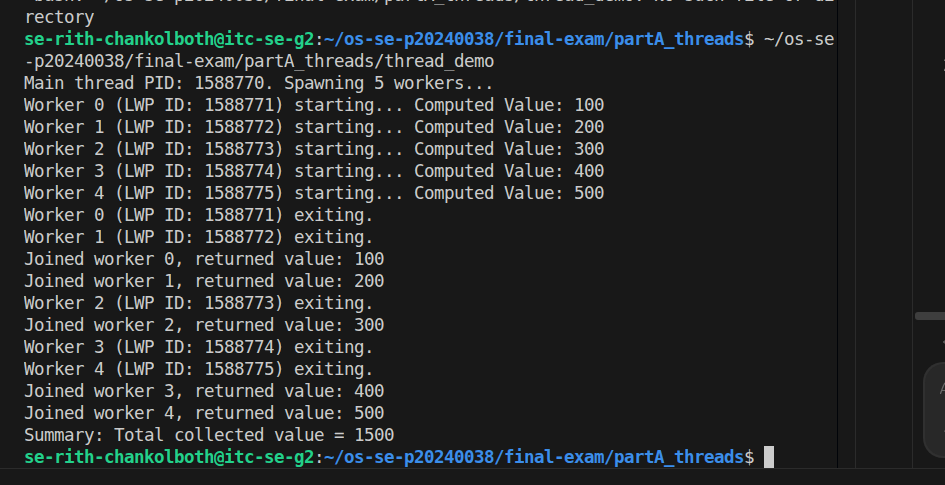
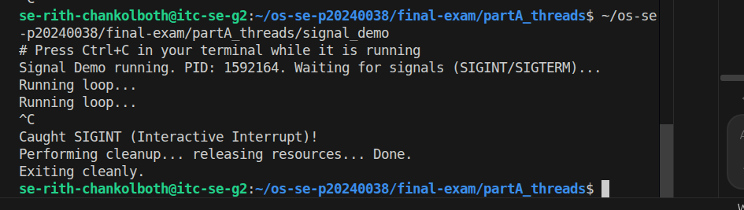
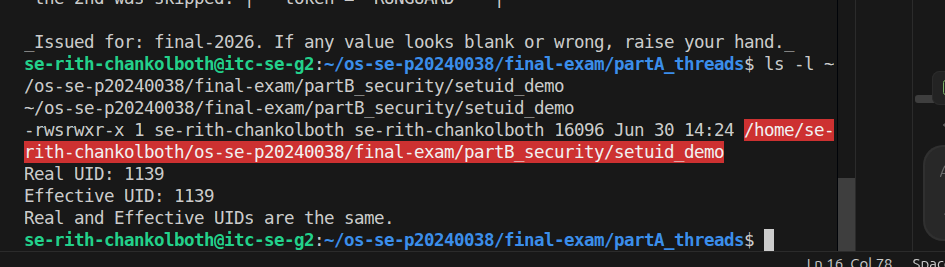
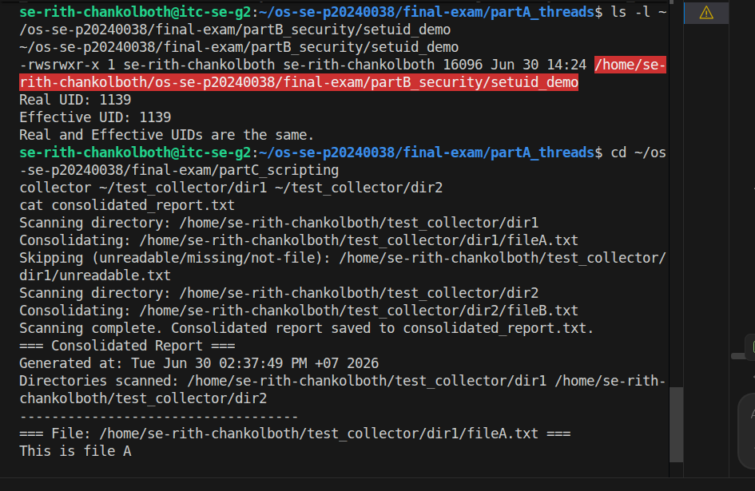
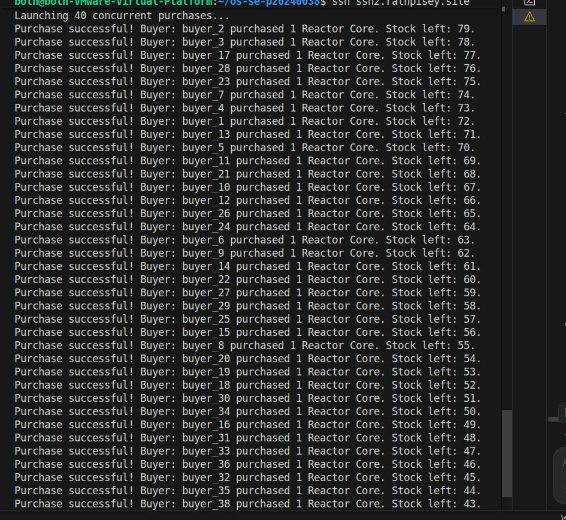
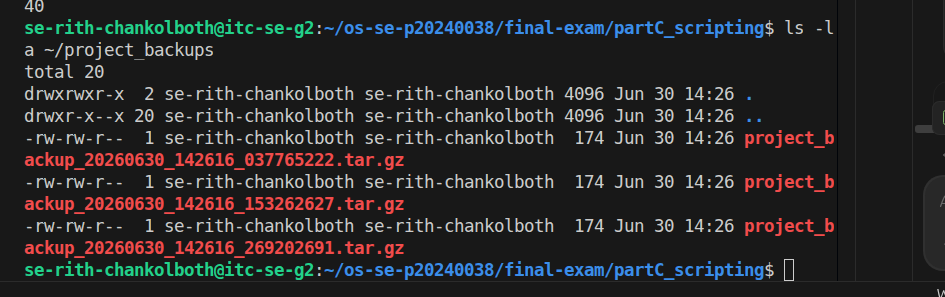

# Final Exam — <Your Name>

<!-- ===== COVER SHEET — required first section. Fill EVERY line. ===== -->
```
Student name:
Student ID:
Server username:
Exam scenario value (COMPANY / PRODUCT):
Date & start time:
AI assistant used (name/none):
```

> Exact commands per part are in `commands.md`. Live-curveball answers are in `live_mods.md`.
> Replace every `<...>` below. Keep answers tied to **your own** scenario numbers.

---

## Part A — Threads, Kernel Mapping & Signals

**Screenshots**




**Written (one short answer)**

- **Why does a worker thread's joined result reach the main thread, but a forked
  child's value would not?**
  <threads share one address space (joined value read from shared memory); a forked
  child runs in a copied address space, so its changes never reach the parent>

**Anything not completed:** <none / ...>

---

## Part B — Files, Permissions & Special Bits

**Screenshot**



**Written (one short answer)**

- **Translate your private file's final octal mode into the 9-char symbolic string**
  (e.g. `600` → `rw-------`).
  octal `<NNN>` → `<rwx-style>`

**Anything not completed:** <none / ...>

---

## Part C — Bash Scripting, PATH & Safe File Scanning

**Screenshot**



**Written (one short answer)**

- **Why did `greeter` fail to run by name before you added your `bin` directory to
  PATH?**
  <the shell only searches directories listed in $PATH; adding ~/bin let it resolve the
  bare name `greeter`>

**Anything not completed:** <none / ...>

---

## Part D — Concurrency, a Race Condition & File Locking

**Screenshot**



**Written (one short answer)**

- **Why did the unpatched `swarm` sometimes leave more stock than the correct final
  value (with `<INITIAL_STOCK>` stock and `<SWARM_SIZE>` concurrent buyers)?**
  <concurrent buyers read the same stale stock (lost update), so some decrements
  overwrote each other — fewer than expected applied>

**Anything not completed:** <note here if the race was hard to reproduce — D3's lock is
what's graded>

---

## Part E — Backups, Archiving & cron Automation

**Screenshot**



**Written (one short answer)**

- **Archiving vs compression — which one actually shrank the bytes, and why?**
  <tar archives (bundles) many files into one; gzip/compression shrinks bytes —
  compression reduced the size>

**Anything not completed:** <none / ...>
