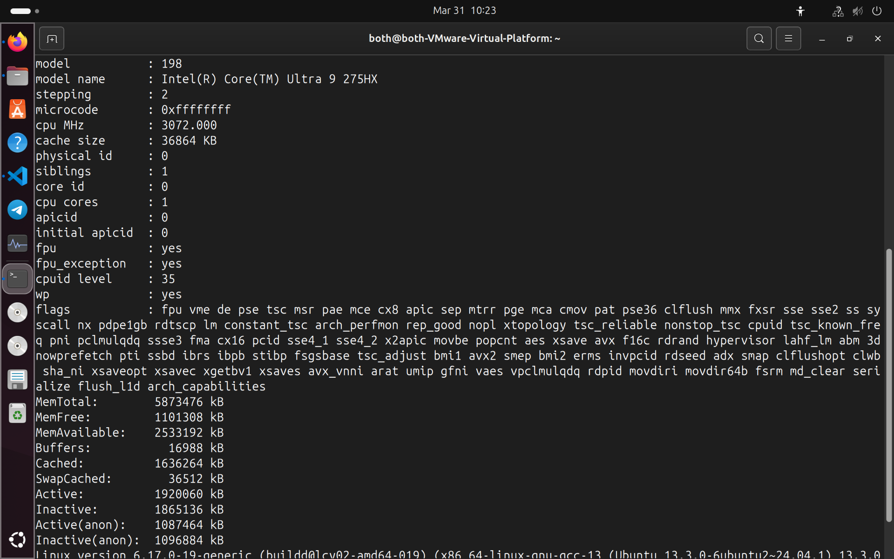
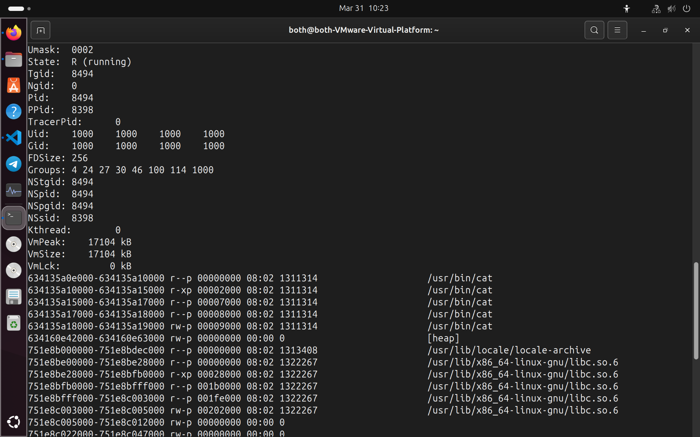
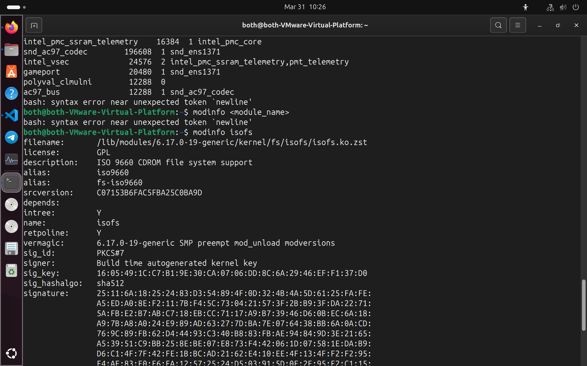
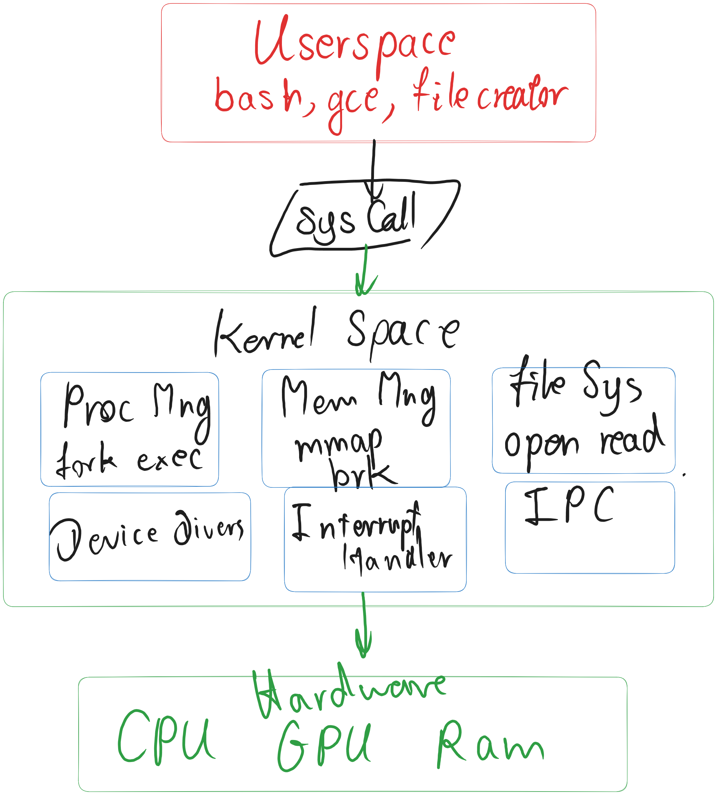

# Class Activity 1 — System Calls in Practice

- **Student Name:** Rith Chankolboth
- **Student ID:** p20240038
- **Date:** [Date of Submission]

---

## Warm-Up: Hello System Call

Screenshot of running `hello_syscall.c` on Linux:

Screenshot of running `hello_winapi.c` on Windows (CMD/PowerShell/VS Code):

Screenshot of running `copyfilesyscall.c` on Linux:

---

## Task 1: File Creator & Reader

### Part A — File Creator

**Describe your implementation:** [What differences did you notice between the library version and the system call version?]

**Version A — Library Functions (`file_creator_lib.c`):**

<!-- Screenshot: gcc -o file_creator_lib file_creator_lib.c && ./file_creator_lib && cat output.txt -->

**Version B — POSIX System Calls (`file_creator_sys.c`):**

<!-- Screenshot: gcc -o file_creator_sys file_creator_sys.c && ./file_creator_sys && cat output.txt -->

**Questions:**

1. **What flags did you pass to `open()`? What does each flag mean?**

   > O_WRONLY (write), O_CREAT (create if missing), O_TRUNC (erase existing content)

2. **What is `0644`? What does each digit represent?**

   > `0644` is the file permission in octal notation: first digit (0) = file type/special bits; second digit (6) = owner permissions (4=read + 2=write); third digit (4) = group permissions (read-only); fourth digit (4) = other/world permissions (read-only). So the file is readable and writable by the owner, readable by group and others.

3. **What does `fopen("output.txt", "w")` do internally that you had to do manually?**

   > `fopen()` internally calls `open()` with O_WRONLY | O_CREAT | O_TRUNC flags and file permission mode (typically 0666 masked by umask), returns a FILE pointer with buffering. In the syscall version, you manually call `open()`, write data with `write()`, and `close()` the file descriptor. `fopen()` abstracts these details and adds buffering via a stream interface.

### Part B — File Reader & Display

**Describe your implementation:** [ I use the `open()` function and store it directory as destination and pass it into read with read only permission from the output.txt. And then i create a buffer variable size of]

**Version A — Library Functions (`file_reader_lib.c`):**

**Version B — POSIX System Calls (`file_reader_sys.c`):**

**Questions:**

1. **What does `read()` return? How is this different from `fgets()`?**

   > [It returns the number of bytes read, it return 0 when it reach end of file but -1 if an error occure]

2. **Why do you need a loop when using `read()`? When does it stop?**

   > [the byte buffer is reading 256 bytes per loop iteration, so it is reading until the end of file]

---

## Task 2: Directory Listing & File Info

**Describe your implementation:** [Your notes]

### Version A — Library Functions (`dir_list_lib.c`)

### Version B — System Calls (`dir_list_sys.c`)

### Questions

1. **What struct does `readdir()` return? What fields does it contain?**

   > [return a pointer to struct dir entry which contains: d_ino, d_off, d_reclen, d_type, d_name\[\]]

2. **What information does `stat()` provide beyond file size?**

   > [return struct stat with data: permission, inode number, device id, hard link count, owner UID and GID, file size in bytes, block size and count, access time modifier, change time]

3. **Why can't you `write()` a number directly — why do you need `snprintf()` first?**

   > [write operates on raw bytes that's why we need snprintf to convert numbers to its string representation]

---

## Optional Bonus: Windows API (`file_creator_win.c`)

Screenshot of running on Windows:

### Bonus Questions

1. **Why does Windows use `HANDLE` instead of integer file descriptors?**

   > [Your answer]

2. **What is the Windows equivalent of POSIX `fork()`? Why is it different?**

   > [Your answer]

3. **Can you use POSIX calls on Windows?**

   > [Your answer]

---

## Task 3: strace Analysis

**Describe what you observed:** [Why is the sys call slower than the library]

### strace Output — Library Version (File Creator)

<!-- Screenshot: strace -e trace=openat,read,write,close ./file_creator_lib -->
<!-- IMPORTANT: Highlight/annotate the key system calls in your screenshot -->

### strace Output — System Call Version (File Creator)

<!-- Screenshot: strace -e trace=openat,read,write,close ./file_creator_sys -->
<!-- IMPORTANT: Highlight/annotate the key system calls in your screenshot -->

### strace Output — Library Version (File Reader or Dir Listing)

### strace Output — System Call Version (File Reader or Dir Listing)

### strace -c Summary Comparison

<!-- Screenshot of `strace -c` output for both versions -->

### Questions

1. **How many system calls does the library version make compared to the system call version?**

   > [38vs33]

2. **What extra system calls appear in the library version? What do they do?**

   > [Your answer — mention `brk`, `mmap`, `fstat`, etc.]

3. **How many `write()` calls does `fprintf()` actually produce?**

   > [Your answer]

4. **In your own words, what is the real difference between a library function and a system call?**

   > [Your answer]

---

## Task 4: Exploring OS Structure

### System Information

> 📸 Screenshot of `uname -a`, `/proc/cpuinfo`, `/proc/meminfo`, `/proc/version`, `/proc/uptime`:

### Process Information

> 📸 Screenshot of `/proc/self/status`, `/proc/self/maps`, `ps aux`:

### Kernel Modules

> 📸 Screenshot of `lsmod` and `modinfo`:

### OS Layers Diagram

> 📸 Your diagram of the OS layers, labeled with real data from your system:

### Questions

1. **What is `/proc`? Is it a real filesystem on disk?**

   > [Your answer]

2. **Monolithic kernel vs. microkernel — which type does Linux use?**

   > [Your answer]

3. **What memory regions do you see in `/proc/self/maps`?**

   > [Your answer]

4. **Break down the kernel version string from `uname -a`.**

   > [Your answer]

5. **How does `/proc` show that the OS is an intermediary between programs and hardware?**

   > [Your answer]

---

## Reflection

What did you learn from this activity? What was the most surprising difference between library functions and system calls?

> [Write your reflection here]
