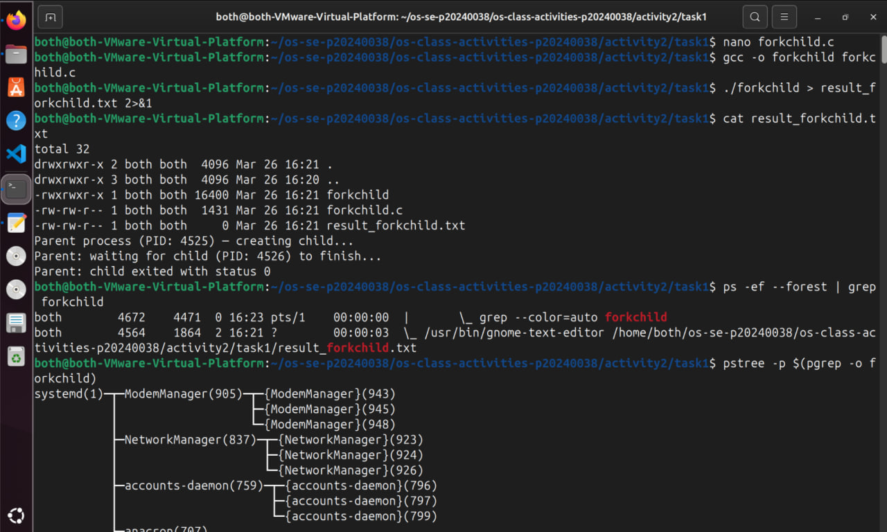
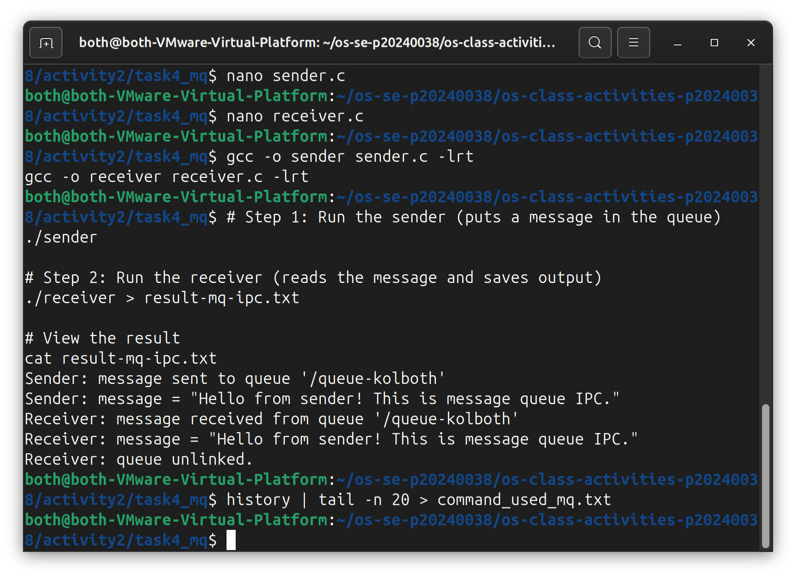

# Class Activity 2 — Processes & Inter-Process Communication

- **Student Name:** [Rith Chankolboth]
- **Student ID:** [p20240038]
- **Date:** [4/9/2026]

---

## Task 1: Process Creation on Linux (fork + exec)

### Compilation & Execution

Screenshot of compiling and running `forkchild.c`:



### Output

```
[Paste the content of result_forkchild.txt here]
```

### Questions

1. **What does `fork()` return to the parent? What does it return to the child?**

   > [fork() returns the child's process ID (PID) to the parent process. It returns 0 to the child process. If fork() fails, it returns -1 to the parent.]

2. **What happens if you remove the `waitpid()` call? Why might the output look different?**

   > [Without waitpid(), the parent process will exit immediately without waiting for the child to complete. The child becomes an orphan process (its parent is dead) and gets adopted by the init process (PID 1). The output would appear incomplete or out of order because the parent's "done" message prints before the child finishes running ls, and there's no synchronization between parent and child execution.]

3. **What does `execlp()` do? Why don't we see "execlp failed" when it succeeds?**

   > [execlp() replaces the current process image with a new program (in this case, ls -la). When successful, execlp() never returns — the process is completely replaced by the new program. The perror() statement only executes if execlp() fails, which is why we don't see "execlp failed" when it succeeds.]

4. **Draw the process tree for your program (parent → child). Include PIDs from your output.**

   > [Your answer / diagram]`

5. **Which command did you use to view the process tree (`ps --forest`, `pstree`, or `htop`)? What information does each column show?**

   > [You can use any of these three commands:

ps --forest — Shows a tree view of processes with the following columns:

PID: Process ID
TTY: Terminal type the process is running on
STAT: Process state (R=running, S=sleeping, T=stopped, Z=zombie)
TIME: CPU time used
COMMAND: The command/program name
pstree — Shows a visual tree hierarchy of all running processes, with simpler ASCII art output

Shows parent-child relationships clearly
Can include PIDs with the -p flag: pstree -p
htop — An interactive process viewer showing a tree mode (press F5 to toggle tree view) with columns:

PID: Process ID
USER: Owner of the process
VIRT/RES: Virtual and resident memory
SHR: Shared memory
CPU%/MEM%: CPU and memory usage percentages
COMMAND: The command/program name]

---

## Task 2: Process Creation on Windows

### Compilation & Execution

Screenshot of compiling and running `winprocess.c`:


### Task Manager Screenshots

Screenshot showing process tree in the **Processes** tab (mspaint nested under your program):


Screenshot showing PID and Parent PID in the **Details** tab:


### Questions

1. **What is the key difference between how Linux creates a process (`fork` + `exec`) and how Windows does it (`CreateProcess`)?**

   > [Linux (fork + exec): A two-step process

fork() creates a direct copy of the parent process (both parent and child continue executing)
exec() replaces the child's image with a new program
Windows (CreateProcess): A single atomic step

CreateProcess() creates a completely new process image in one call without duplicating the parent
The new process starts at the entry point specified, not as a copy of the parent
More efficient and cleaner from an API perspective]

2. **What does `WaitForSingleObject()` do? What is its Linux equivalent?**

   > [WaitForSingleObject() blocks the parent process until a specified object (in this case, the child process handle pi.hProcess) is signaled or a timeout occurs. When INFINITE is passed, it waits indefinitely.

Linux equivalent: waitpid(pid, &status, 0) — it also blocks the parent until the child process terminates.]

3. **Why do we need to call `CloseHandle()` at the end? What happens if we don't?**

   > [CloseHandle() releases system resources associated with the process and thread handles.

If we don't call it:

Handle leak: The kernel keeps the handle objects alive in memory
Resource exhaustion: If this happens repeatedly in a long-running program, the system may run out of available handles
Memory waste: Handles consume kernel memory that's never reclaimed
The process objects won't be fully cleaned up until the parent process terminates]

4. **In Task Manager, what was the PID of your parent program and the PID of mspaint? Do they match your program's output?**

   > [for some reason it doesnt look like it match]

5. **Compare the Processes tab (tree view) and the Details tab (PID/PPID columns). Which view makes it easier to understand the parent-child relationship? Why?**

   > [tree view better cuz it shows the process created from what]

---

## Task 3: Shared Memory IPC

### Compilation & Execution

Screenshot of compiling and running `shm-producer` and `shm-consumer`:


### Output

```
[Paste the content of result-shm-ipc.txt here]
```

### Questions

1. **What does `shm_open()` do? How is it different from `open()`?**

   > [hm_open() creates or opens a POSIX shared memory object (identified by a name like a pathname).

Differences from open():

shm_open() creates shared memory in RAM, not on disk
open() opens a regular file from the filesystem
shm_open() returns a file descriptor that represents a shared memory segment, which can then be mapped with mmap()
Multiple unrelated processes can access the same shared memory by name, without needing file permissions or a shared filepath]

2. **What does `mmap()` do? Why is shared memory faster than other IPC methods?**

   > [mmap() maps shared memory (or a file) into the process's virtual address space, making the memory directly accessible via pointers.

Why shared memory is faster:

No copying: Processes access the same physical memory directly, so data doesn't need to be copied between processes
In RAM: Shared memory resides in RAM, not disk, so access is extremely fast
Direct memory access: Communication is as simple as reading/writing to a memory address, no system call overhead after the initial mmap()]

3. **Why must the shared memory name match between producer and consumer?**

   > [The shared memory name (in this case, "OS-kolboth") is the unique identifier that both processes use to locate and access the same shared memory object. If names don't match, each process will create/open different shared memory segments and won't communicate.]

4. **What does `shm_unlink()` do? What would happen if the consumer didn't call it?**

   > [shm_unlink() removes the shared memory object from the system, freeing its resources.

If the consumer doesn't call it:

The shared memory object persists in memory even after both processes exit
It occupies RAM and kernel resources indefinitely
If the producer runs again, it would open the old shared memory from the previous run instead of creating a fresh one
Manual cleanup would be needed using ipcrm -M <key> or similar]

5. **If the consumer runs before the producer, what happens? Try it and describe the error.**

   > [The consumer will fail with:

This happens because:

The consumer tries to open an existing shared memory object with O_RDONLY
The producer hasn't created the shared memory yet (since it runs after)
shm_open() can't find the shared memory object and returns -1, causing perror() to display the error> shm_open: No such file or directory
Hint: Did you run shm-producer first?]

---

## Task 4: Message Queue IPC

### Compilation & Execution

Screenshot of compiling and running `sender` and `receiver`:



### Output

```
[Paste the content of result-mq-ipc.txt here]
```

### Questions

1. **How is a message queue different from shared memory? When would you use one over the other?**

   > [Shared Memory:

Direct access to a shared memory region with pointers
Synchronization is the programmer's responsibility
Faster but requires explicit coordination (mutexes, semaphores)
Message Queues:

Messages are passed between processes in a queue (FIFO order)
Ordering and blocking are built-in; sender waits if queue is full, receiver waits if queue is empty
Thread-safe by design, no explicit synchronization needed
When to use:

Shared memory: When you need high-speed access to data and can manage synchronization (e.g., caching, databases)
Message queues: When you need ordered message delivery with automatic synchronization and decoupling (e.g., producer-consumer patterns, task queues)
]

2. **Why does the queue name in `common.h` need to start with `/`?**

   > [POSIX message queue names must start with / because they follow pathname-like conventions. The / prefix indicates that it's a kernel-managed object rather than a regular filename. This distinguishes message queue names from regular paths and ensures they're resolved by the message queue namespace in the kernel.]

3. **What does `mq_unlink()` do? What happens if neither the sender nor receiver calls it?**

   > [mq_unlink() removes the message queue object from the system, freeing its resources.

If neither process calls it:

The message queue persists in the kernel even after both processes exit
It occupies kernel memory indefinitely
If sender/receiver run again, they access the old queue with stale messages instead of a fresh one
Manual cleanup is needed using ipcrm -q <key> or similar]

4. **What happens if you run the receiver before the sender?**

   > [The receiver will fail with:

This happens because:

The receiver tries to open an existing message queue with O_RDONLY
The sender hasn't created the queue yet (runs after)
mq_open() can't find the queue and returns -1, causing the error]

5. **Can multiple senders send to the same queue? Can multiple receivers read from the same queue?**

   > [Multiple senders: Yes — Multiple senders can send messages to the same queue. All messages are queued in FIFO order.

Multiple receivers: Yes technically, but with a caveat — Multiple receivers can open the queue, but only one receiver at a time can call mq_receive() and get a message. Once a message is received by one receiver, it's removed from the queue and not available to others.]

---

## Reflection

What did you learn from this activity? What was the most interesting difference between Linux and Windows process creation? Which IPC method do you prefer and why?

> [Write your reflection here]# Class Activity 2 — Processes & Inter-Process Communication


