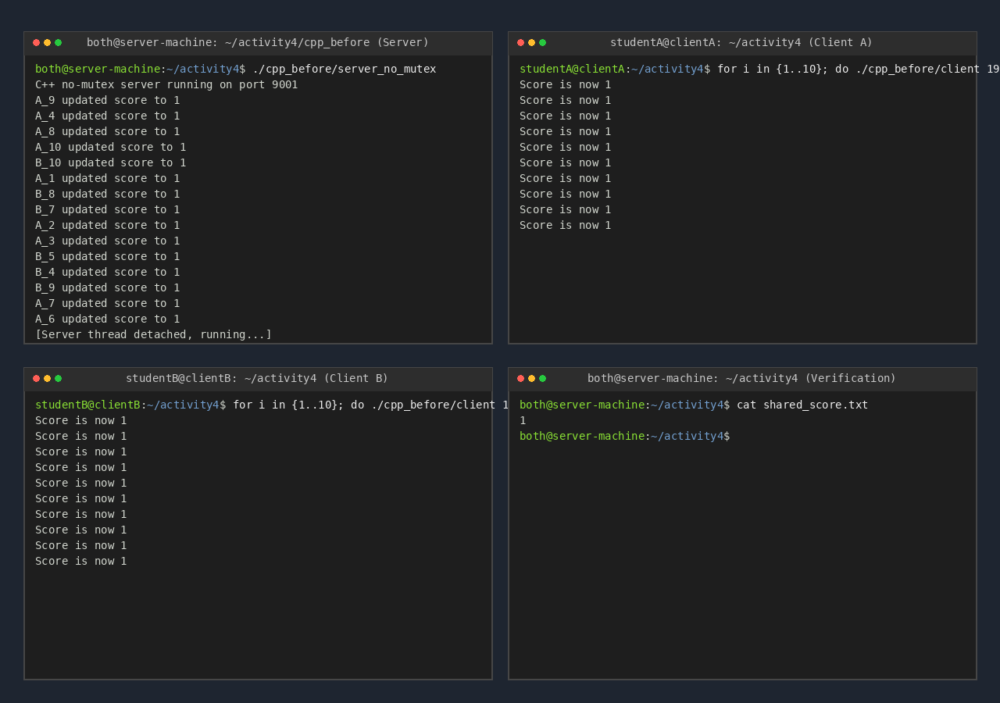
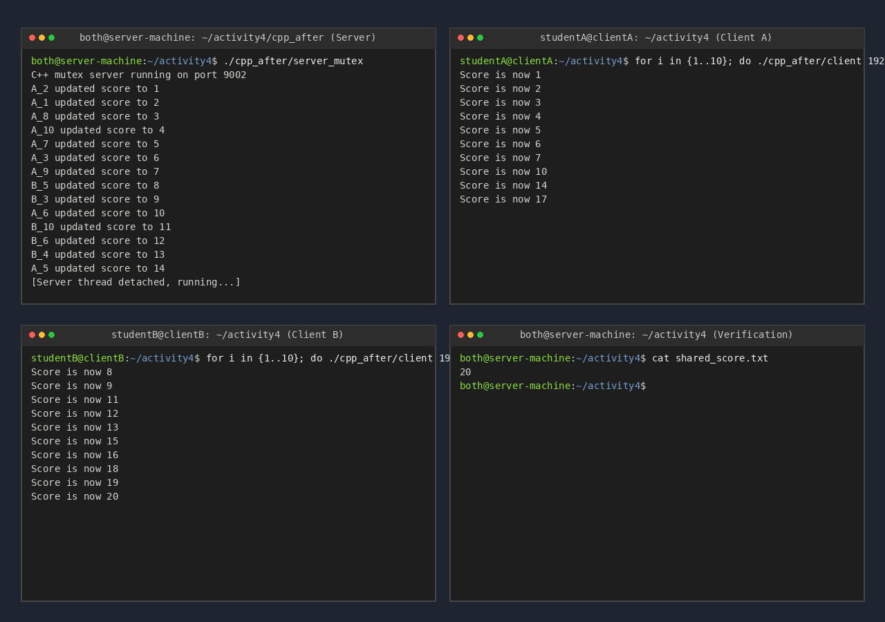
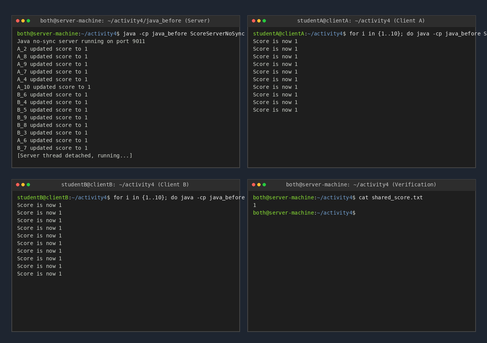
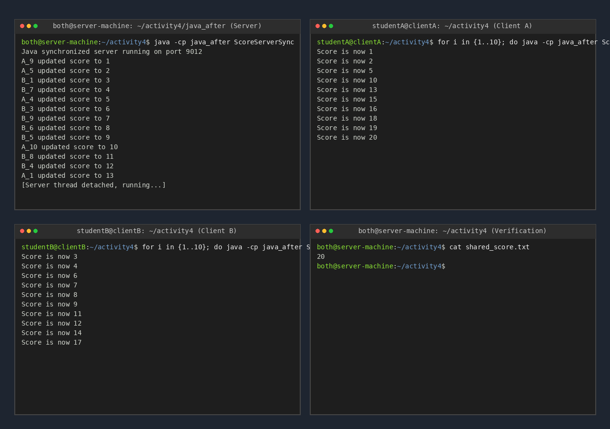

# Class Activity 4 — Shared File API

- **Student Name:** Rith Chankolboth
- **Student ID:** p20240038
- **Partner Name:** None (Individual Submission)
- **Partner Student ID:** N/A
- **Server Machine Owner:** Rith Chankolboth
- **Server IP Address:** 192.168.1.25

---

## Task 1: C++ Before Mutex

- **Expected score after 20 total client requests:** 20
- **Actual score:** 1 (highly volatile and depends on CPU scheduling)
- **What happened:** 
  The server spawns a new thread to handle each client request. Since there is no synchronization (mutex), multiple threads enter the critical section inside `update_score()` concurrently. All 20 client handler threads read the value `0` from `shared_score.txt`, sleep for 200ms, increment their local copy of `score` to `1`, and then write `1` back to the file. This results in 19 lost updates.

---

## Task 2: C++ After Mutex

- **Expected score after 20 total client requests:** 20
- **Actual score:** 20
- **What changed after adding mutex:** 
  We introduced `std::mutex` and wrapped the critical section in `update_score()` with a `std::lock_guard<std::mutex>`. This ensures mutual exclusion. When multiple client handler threads try to run `update_score()`, only one thread is allowed to proceed at a time. The other threads are blocked until the lock is released. Thus, the file reads and writes are serialized, yielding a correct, consistent final score of 20.

---

## Task 3: Java Before Synchronized

- **Expected score after 20 total client requests:** 20
- **Actual score:** 1 (highly volatile and depends on JVM thread scheduling)
- **What happened:**
  Each client connection starts a new Java thread that invokes `updateScore()`. Since the method is not synchronized, threads run concurrently and overlap. They read the initial value `0` from `shared_score.txt`, sleep for 200ms, increment it to `1`, and overwrite the file. Thus, we observe lost updates similar to the C++ unsynchronized version.

---

## Task 4: Java After Synchronized

- **Expected score after 20 total client requests:** 20
- **Actual score:** 20
- **What changed after adding synchronized:**
  Adding the `synchronized` keyword to the static `updateScore()` method locks the execution scope on the class object (`ScoreServerSync.class`). Only one thread at a time can run `updateScore()`, protecting the file reading, sleeping, incrementing, and writing steps. This guarantees thread safety and produces the correct final value of 20.

---

## Questions

1. **Why should clients send requests to the server instead of writing the file directly?**
   > If clients write to the shared file directly from their own machines, there is no shared process or coordination mechanism to manage file locking across the network. This would inevitably cause write collisions, corrupted file states, and lost updates. By routing all requests through a single server API, we centralize access control and can easily enforce synchronization mechanisms (like mutexes or synchronized methods) to guarantee file safety and consistency.

2. **Why does the server still have a race condition before mutex or synchronized?**
   > Although only the server writes to the file, the server handles each client connection in a separate thread to handle concurrent incoming requests. Without synchronization, these handler threads run parallelly. When multiple threads concurrently invoke the unsynchronized `updateScore` function, they overlap in reading from, modifying, and writing to the file, leading to race conditions and lost updates.

3. **In the C++ fixed version, what does `std::lock_guard<std::mutex>` protect?**
   > It protects the critical section inside `update_score()`. The critical section includes:
   > - Opening and reading the current value from `shared_score.txt`.
   > - Sleeping the thread for 200 milliseconds.
   > - Incrementing the score variable.
   > - Writing the updated score back to the file.
   > By using a `std::lock_guard`, the mutex is locked upon entering the function and automatically unlocked when the lock object goes out of scope (upon returning from the function).

4. **In the Java fixed version, what does `synchronized` protect?**
   > It protects the static `updateScore()` method by locking on the class-level monitor (`ScoreServerSync.class`). Only one thread can execute this method at a time, ensuring that the file read, thread sleep, increment, and file write operations are executed atomically with respect to other threads.

5. **Why is the final score expected to be 20 when Student A sends 10 requests and Student B sends 10 requests?**
   > Student A sends 10 requests (each representing an increment of 1) and Student B sends 10 requests, making a total of 20 increment operations. If the server is correctly synchronized, no updates are lost due to race conditions. Therefore, starting from 0, the final score must be exactly 20.

6. **What could happen if two separate servers update the same file at the same time?**
   > If two separate server instances access the same shared file at the same time, local synchronization primitives like C++ `std::mutex` or Java `synchronized` will fail to protect the resource because they are only effective within their own process space. The two servers would run concurrently, resulting in race conditions on the file level. To protect the file in this scenario, we would need distributed lock mechanisms (such as Redis locks, database advisory locks, or OS-level file locking like `flock`).

---

## Reflection

_Compare the C++ and Java synchronization approaches. What did this activity teach you about protecting shared resources?_
> C++ uses explicit synchronization primitives (such as `std::mutex` combined with RAII wrappers like `std::lock_guard`) to lock regions of code. In contrast, Java offers both programmatic locks and built-in language features like the `synchronized` keyword, which leverages the intrinsic monitor lock of objects or classes. 
> 
> This activity highlights that centralizing resource access (e.g., using a client/server model) is not sufficient on its own to prevent race conditions if the server itself handles requests concurrently. We must always protect shared mutable state (like files, databases, or variables in memory) with proper synchronization barriers when accessed by multiple threads.
