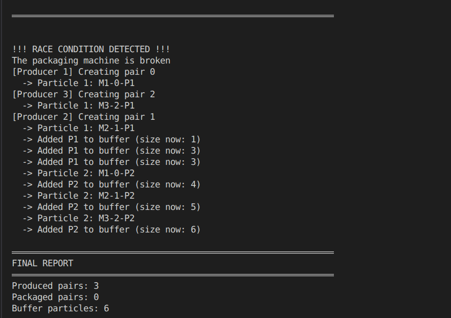
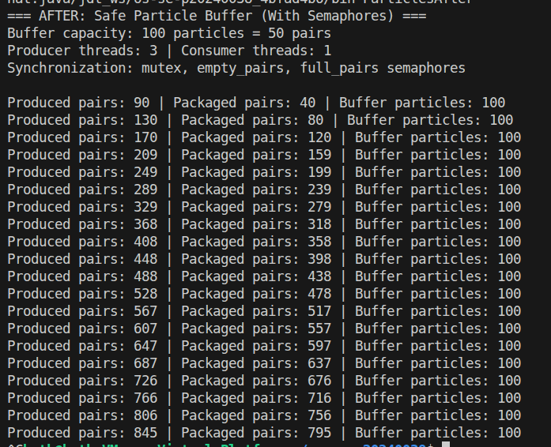
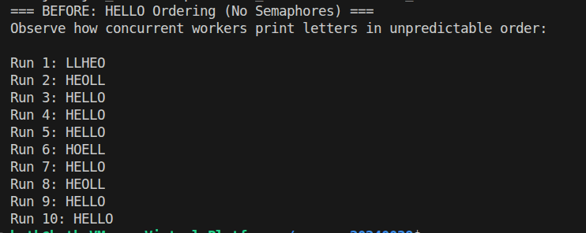
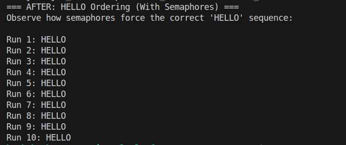

# Class Activity 5 - Semaphores

- **Student Name:** Rith Chankolboth
- **Student ID:** p20240038
- **Programming Language Used:** Java

---

## Task 1A: Particle Pair Buffer Before Semaphores

- **What error or incorrect behavior appeared:**
  Depending on the chosen mode, the program fails with one of three errors:
  1. `The packaging machine is broken` (Empty Buffer error) - when the consumer attempts to fetch from an empty buffer.
  2. `The producing machine is broken` (Full Buffer error) - when producers attempt to add particles to a full buffer (size >= 100).
  3. `Pairs are incorrect` (Incorrect Pair error) - when the consumer fetches a mismatched pair because producer and consumer threads interleave without synchronization.
- **Why did this happen without semaphore protection:**
  Because the buffer access (adding and removing particles) is not synchronized. Multiple threads concurrently modify the `ArrayList` buffer without mutual exclusion, leading to state corruption and incorrect item ordering. Furthermore, there are no coordination mechanisms to block producers when the buffer is full or block consumers when the buffer is empty.

---

## Task 1B: Particle Pair Buffer After Semaphores

- **Number of producer machines:** 3
- **Buffer capacity:** 100 particles (50 pairs)
- **Semaphores used:** 
  - `emptyPairs` (initialized to 50)
  - `fullPairs` (initialized to 0)
  - `mutex` (initialized to 1)
- **Produced pair count shown in screenshot:** [Check screenshot]
- **Packaged pair count shown in screenshot:** [Check screenshot]
- **Did any error appear during normal operation?** No, the semaphores correctly synchronized the threads, ensuring buffer boundaries were respected and pairs were matched.

---

## Task 2A: HELLO Before Semaphores

- **Output before semaphore ordering:** Unpredictable and out-of-order sequences of letters (e.g., `LLHOE`, `OLLHE`, etc.).
- **Why this output can be wrong or unpredictable:**
  The threads run concurrently and are scheduled nondeterministically by the OS scheduler. Without synchronization, they print their characters in arbitrary order.

---

## Task 2B: HELLO After Semaphores

- **Processes or threads used:** 3 concurrent threads (Thread 1, Thread 2, Thread 3).
- **Semaphores used:**
  - `startH` (initialized to 1)
  - `afterE` (initialized to 0)
  - `afterL1` (initialized to 0)
  - `afterL2` (initialized to 0)
- **Final output:** `HELLO` (consistently printed across all runs).

---

## Questions

1. **In Task 1, why does a producer need to wait before adding a pair to the buffer?**
   The producer must wait to ensure there are at least two empty slots in the buffer. If the buffer is full (i.e. already has 100 particles), attempting to add more particles would cause a buffer overflow (Full Buffer error).

2. **In Task 1, why does the consumer need to wait before removing a pair from the buffer?**
   The consumer must wait to ensure there is at least one full pair (2 particles) in the buffer. If the consumer tries to fetch particles when the buffer is empty or contains only 1 particle, it would cause a buffer underflow (Empty Buffer error).

3. **Which semaphore protects the critical section in your particle buffer program?**
   The `mutex` binary semaphore (initialized to 1) protects the critical section. It ensures that only one thread can modify the shared buffer list at any given time.

4. **How does your program verify that `P1` and `P2` belong to the same pair?**
   Each particle is produced in the format `M<machineId>-<pairId>-P1` or `M<machineId>-<pairId>-P2`. The consumer splits each particle's string representation by the hyphen (`-`) and compares the producer machine ID and the pair ID. If they do not match, it identifies that a race condition occurred and prints the mismatch error.

5. **In Task 2, why can the program print letters in the wrong order without semaphores?**
   Without semaphores, the threads print to stdout concurrently without any synchronization or execution constraints. Since the operating system schedules threads nondeterministically, the characters `H`, `E`, `L`, `L`, `O` can be interleaved in any arbitrary order.

6. **Which semaphore or synchronization step forces `H` to print before `E`, `L`, `L`, and `O`?**
   The `startH` semaphore is initialized to 1, while all other semaphores (`afterE`, `afterL1`, `afterL2`) are initialized to 0. This forces Thread 1 (printing `H` and `E`) to run first, while blocking the other threads until Thread 1 signals `afterE`.

7. **What could cause deadlock in either of your simulations?**
   - **In Task 1:** If a thread acquires the `mutex` semaphore *before* waiting on `empty_pairs` or `full_pairs`. For example, if the consumer acquires `mutex` first and then waits on `full_pairs` while the buffer is empty, it blocks any producer from acquiring `mutex` to add items, creating a deadlock.
   - **In Task 2:** If the semaphores are incorrectly initialized (e.g. all set to 0), or if a thread fails to release/signal the next semaphore in the sequence, causing all subsequent threads to wait indefinitely.

---

## Reflection

These simulations clearly demonstrate that semaphores are highly versatile primitives. They can be used for resource counting and capacity management (as with `emptyPairs` and `fullPairs` in Task 1), enforcing mutual exclusion (as with `mutex` in Task 1), and defining strict execution ordering constraints among concurrent processes (as in Task 2).
