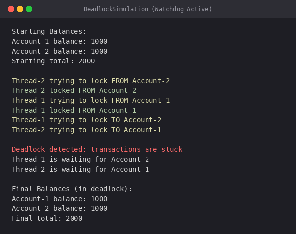
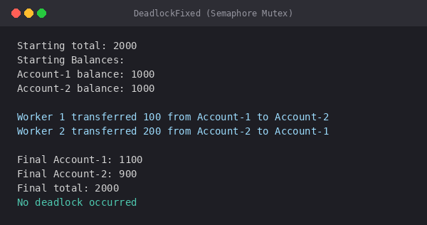

# Class Activity 6 - Deadlock Simulation: Bank Account Transfers

> **Related Lectures**: Week 9 - Deadlocks  
> **Topics**: Deadlock, mutual exclusion, hold-and-wait, circular wait, deadlock prevention, semaphore mutex  
> **Language**: Java starter code provided; other languages allowed with equivalent threads and semaphores  
> **Environment**: Linux, WSL, macOS, or Windows with Java JDK or another runtime that supports threads and semaphores

---

## Objective

In this activity, you will simulate a real deadlock using a bank transaction example.

Two bank accounts are shared resources. Two transaction workers try to transfer money at the same time:

```text
Transaction 1: transfer from Account A to Account B
Transaction 2: transfer from Account B to Account A
```

If each transaction locks its source account first, then tries to lock the destination account, the program can deadlock:

```text
Transaction 1 holds Account A and waits for Account B
Transaction 2 holds Account B and waits for Account A
```

Then you will fix the problem using one semaphore mutex initialized to `1`.

---

## Task Overview

| Task | What You Do | Screenshot Required |
|------|-------------|--------------------|
| **Task 1** | Create a bank transfer program that can deadlock | Deadlock detected/stuck output |
| **Task 2** | Fix the deadlock using a semaphore mutex initialized to `1` | Successful transfers with no deadlock |
| **Task 3** | Explain the deadlock using the four deadlock conditions | README answers |

You may use any programming language, but Java starter code is provided. Your README must clearly say which language you used and how to run each program.

---

## Setup

Create your activity folder:

```bash
mkdir -p activity6/{task1_deadlock,task2_prevention,screenshots}
cd activity6
```

Recommended filenames:

```text
task1_deadlock/bank_deadlock.<extension>
task2_prevention/bank_no_deadlock.<extension>
README.md
screenshots/task1_deadlock.png
screenshots/task2_prevention.png
```

Examples:

```text
DeadlockSimulation.java
DeadlockFixed.java
bank_deadlock.py
bank_no_deadlock.py
```

---

## Bank Transaction Model

Use at least two accounts:

```text
Account A balance: 1000
Account B balance: 1000
```

Each account must have:

- an account name or ID
- a balance
- a lock, mutex, monitor, or semaphore

The transfer operation must:

1. lock the first account
2. wait briefly so another thread has time to run
3. lock the second account
4. move money
5. unlock both accounts

Use a small sleep inside the transfer function to make the deadlock easier to observe.

---

## Task 1: Deadlock Version

### Goal

Write a program that intentionally demonstrates deadlock.

### Required Behavior

Create two concurrent workers:

```text
Worker 1: transfer 100 from Account A to Account B
Worker 2: transfer 200 from Account B to Account A
```

In this version, each worker should lock the source account first, then the destination account.

### Java Starter Code

Use this starter code for Task 1. You may copy it into:

```text
task1_deadlock/DeadlockSimulation.java
```

You must still edit, run, and explain it yourself. In particular, add a watchdog, timeout, or progress check so the program prints the required deadlock message instead of only hanging.

```java
import java.util.concurrent.Semaphore;

class Account {
    String name;
    int balance;
    Semaphore lock = new Semaphore(1);

    Account(String name, int balance) {
        this.name = name;
        this.balance = balance;
    }
}

class Transfer {
    static void transfer(Account from, Account to, int amount) {
        try {
            System.out.println(Thread.currentThread().getName()
                    + " trying to lock FROM " + from.name);
            from.lock.acquire();
            System.out.println(Thread.currentThread().getName()
                    + " locked FROM " + from.name);

            Thread.sleep(100);

            System.out.println(Thread.currentThread().getName()
                    + " trying to lock TO " + to.name);
            to.lock.acquire();
            System.out.println(Thread.currentThread().getName()
                    + " locked TO " + to.name);

            from.balance -= amount;
            to.balance += amount;

            System.out.println(Thread.currentThread().getName()
                    + " transfer completed");

            to.lock.release();
            from.lock.release();
        } catch (InterruptedException e) {
            e.printStackTrace();
        }
    }
}

public class DeadlockSimulation {
    public static void main(String[] args) {
        Account account1 = new Account("Account-1", 1000);
        Account account2 = new Account("Account-2", 1000);

        Thread t1 = new Thread(() ->
                Transfer.transfer(account1, account2, 100),
                "Thread-1"
        );

        Thread t2 = new Thread(() ->
                Transfer.transfer(account2, account1, 200),
                "Thread-2"
        );

        t1.start();
        t2.start();
    }
}
```

Compile and run:

```bash
cd activity6
javac task1_deadlock/DeadlockSimulation.java
java -cp task1_deadlock DeadlockSimulation
```

### What You Must Edit

Do not submit the starter code unchanged. Modify it so your screenshot shows the deadlock clearly.

Minimum edits:

- print the starting account balances
- print which thread is waiting for which account
- add a watchdog or timeout that prints `Deadlock detected: transactions are stuck`
- print final balances if any transfer completes
- explain in your README why the program got stuck

Unsafe transfer idea:

```text
transfer(from_account, to_account, amount):
    lock(from_account)
    sleep briefly
    lock(to_account)
    move money
    unlock(to_account)
    unlock(from_account)
```

This creates the circular-wait possibility:

```text
Worker 1 holds A, waits for B
Worker 2 holds B, waits for A
```

### Required Deadlock Detection Output

Your program should not hang silently forever. Add a watchdog, timeout, or progress counter.

If no transaction completes after a few seconds, print:

```text
Deadlock detected: transactions are stuck
```

Then print the current lock state or a short explanation, such as:

```text
Worker 1 is waiting for Account B
Worker 2 is waiting for Account A
```

### Screenshot

Take one screenshot:

```text
screenshots/task1_deadlock.png
```

Your screenshot must show:

- both transaction workers started
- the program detected or clearly demonstrated the deadlock
- the exact message `Deadlock detected: transactions are stuck`

---

## Task 2: Deadlock Prevention Version

### Goal

Fix the bank transfer program so the same transactions complete without deadlock.

### Required Strategy

Use **one semaphore mutex initialized to `1`** to protect the full transfer operation.

In Java, this means adding a shared semaphore:

```java
static Semaphore mutex = new Semaphore(1);
```

Then every transfer must acquire the same mutex before touching either account:

```text
transfer(from_account, to_account, amount):
    wait(mutex)
    sleep briefly
    move money from from_account to to_account
    signal(mutex)
```

This prevents deadlock because only one transfer can hold the banking critical section at a time. There is no circular wait between account locks.

### What You Must Edit

Create a fixed version, such as:

```text
task2_prevention/DeadlockFixed.java
```

You may reuse your Task 1 code, but you must remove the deadlock by using the shared semaphore mutex.

Minimum edits:

- create `static Semaphore mutex = new Semaphore(1)`
- acquire `mutex` before updating accounts
- release `mutex` after the transfer is complete
- use `try/finally` or equivalent cleanup so the mutex is released even if an error happens
- run the same two transfer threads as Task 1
- print final balances and total balance

Compile and run:

```bash
cd activity6
javac task2_prevention/DeadlockFixed.java
java -cp task2_prevention DeadlockFixed
```

### Required Output

Your program must print:

- starting balances
- each successful transfer
- final balances
- total money before and after
- confirmation that no deadlock occurred

Example:

```text
Starting total: 2000
Worker 1 transferred 100 from A to B
Worker 2 transferred 200 from B to A
Final A: 1100
Final B: 900
Final total: 2000
No deadlock occurred
```

The final total must remain the same as the starting total.

### Screenshot

Take one screenshot:

```text
screenshots/task2_prevention.png
```

Your screenshot must show:

- the fixed program running
- both transfers completed
- final total is unchanged
- the message `No deadlock occurred`

---

## Optional Extension: Deadlock Recovery

After completing Tasks 1 and 2, you may add a third version using consistent lock ordering, `try_lock`, timeout locks, or non-blocking acquire.

Recovery idea:

```text
try to lock first account
try to lock second account with timeout
if second lock fails:
    release first lock
    wait briefly
    retry
```

This does not remove every deadlock condition, but it can detect waiting too long and recover.

Optional screenshot:

```text
screenshots/task3_recovery.png
```

---

## Questions

Answer these in your `README.md`:

1. What are the two shared resources in your bank transaction simulation?
2. Which line or section of your Task 1 program creates hold-and-wait?
3. How does Task 1 create circular wait?
4. Why does the Task 1 program need a watchdog or timeout?
5. How does the single semaphore mutex prevent deadlock in Task 2?
6. Which of the four deadlock conditions does your Task 2 solution remove or avoid?
7. Why must the final total bank balance remain unchanged after both transfers?

---

## Deliverables & Submission

### Required Screenshots

Submit these screenshots:

```text
screenshots/task1_deadlock.png
screenshots/task2_prevention.png
```

### Required Source Files

Submit your source files. Use names that match your language.

Examples:

```text
task1_deadlock/DeadlockSimulation.java
task2_prevention/DeadlockFixed.java
```

or:

```text
task1_deadlock/bank_deadlock.py
task2_prevention/bank_no_deadlock.py
```

### Submission Folder Structure

```text
os-se-<YourStudentID>/
`-- os-class-activities-<YourStudentID>/
    `-- activity6/
        |-- README.md
        |-- task1_deadlock/
        |   `-- DeadlockSimulation.java
        |-- task2_prevention/
        |   `-- DeadlockFixed.java
        `-- screenshots/
            |-- task1_deadlock.png
            `-- task2_prevention.png
```

### README Template

````markdown
# Class Activity 6 - Deadlock Simulation

- **Student Name:** [Your Name]
- **Student ID:** [Your ID]
- **Programming Language Used:** [Python / C / C++ / Java / Other]

---

## Task 1: Deadlock Version



- Shared resources:
- Transaction 1:
- Transaction 2:
- Deadlock message shown:
- Explanation of why the program got stuck:

---

## Task 2: Deadlock Prevention Version



- Prevention strategy used:
- Semaphore mutex initial value:
- Starting total:
- Final total:
- Did both transfers complete?
- Why no deadlock occurred:

---

## Questions

1. What are the two shared resources in your bank transaction simulation?
2. Which line or section of your Task 1 program creates hold-and-wait?
3. How does Task 1 create circular wait?
4. Why does the Task 1 program need a watchdog or timeout?
5. How does the single semaphore mutex prevent deadlock in Task 2?
6. Which of the four deadlock conditions does your Task 2 solution remove or avoid?
7. Why must the final total bank balance remain unchanged after both transfers?

---

## Reflection

_What did this activity teach you about deadlock prevention in real systems such as banking, databases, or file systems?_
````

---

## Grading Criteria

| Criteria | Points | Description |
|----------|--------|-------------|
| **Task 1 deadlock simulation** | 30 | Demonstrates deadlock with two concurrent transactions and shared account locks. |
| **Task 1 deadlock detection** | 15 | Uses watchdog, timeout, or progress check and prints the required deadlock message. |
| **Task 2 deadlock prevention** | 30 | Fixes the program using a semaphore mutex initialized to `1`. |
| **Balance correctness** | 10 | Final total balance is unchanged after successful transfers. |
| **README and screenshots** | 15 | Screenshots are embedded, source files are submitted, and questions are answered clearly. |
| **Total** | **100** | |

---

## Tips

- Use a small delay after locking the first account to make the deadlock easier to reproduce.
- The required fix uses one semaphore mutex initialized to `1`. It is simple and reliable, but it allows only one transfer at a time.
- A more advanced prevention strategy, such as lock ordering, can allow more concurrency. That is optional for this activity.
- Deadlock is easier to understand if your output says which worker holds which lock.
- If your unsafe version never deadlocks, increase the sleep after the first lock or run the transfer loop multiple times.
