# Class Activity 7 - Reasoning About Deadlock

- **Student Name:** [Rith Chankolboth]
- **Student ID:** [p20240038]
- **My personalization:** a = [last digit], b = [second-to-last digit]

---

## Task 1 — Resource Allocation Graphs

### Part A
**Graph 1 — my prediction:** 
-theres a cycle
-theres a dealock
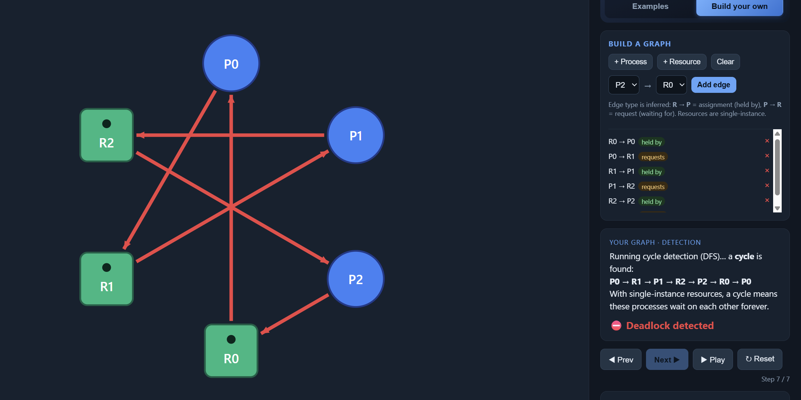
Matched the tool? [yes/no — if no, what I got wrong]

**Graph 2 — my prediction:** [...]
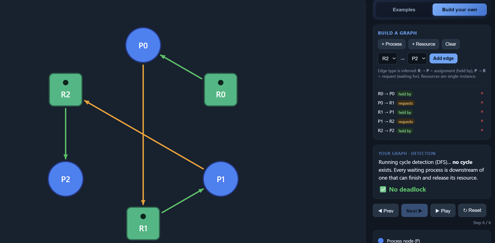
Matched the tool? [...]

### Part B
**(i) Deadlocked 3×3 graph** — edges I used + why it deadlocks:
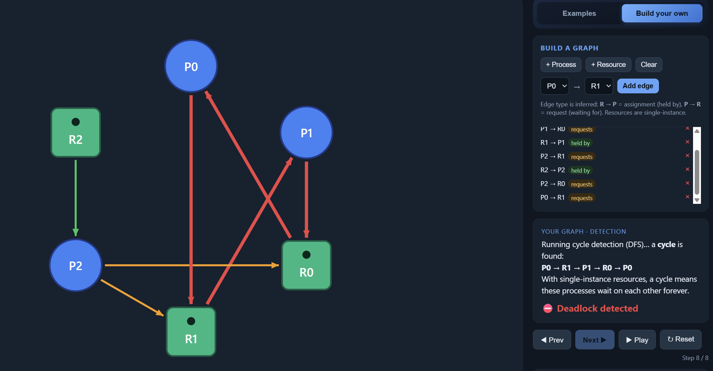

**(ii) No-cycle graph (≥4 nodes, ≥1 request)** — why it is deadlock-free:
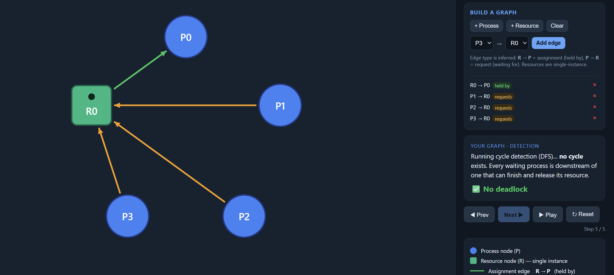

---

## Task 2 — Cycle ≠ Deadlock

**Warm-up (built-in examples)**
1. Why the "Cycle, NO deadlock" example is not deadlocked: [...]
2. The single change that causes deadlock: [...]

**Part A — given scenario**
- Available = Total − ΣAlloc = [...]
- The cycle (as a path): [...]   Process in the cycle that can still finish + why: [...]

| Step | Process | Why Request ≤ Work | Work after release |
|------|---------|--------------------|--------------------|
| 1 | | | |
| 2 | | | |
| 3 | | | |

Conclusion: [DEADLOCKED / NOT deadlocked — finishing order = …]
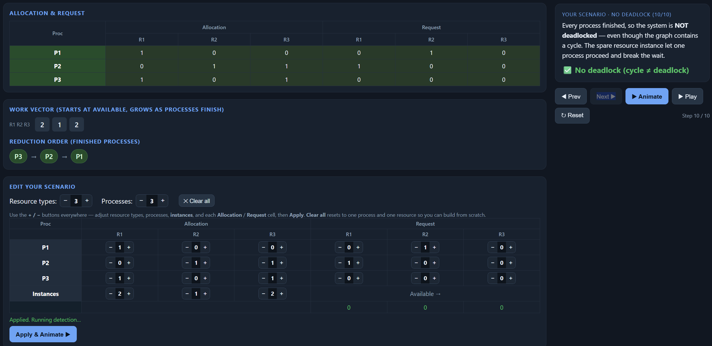
After changing P3's request to `0 1 0` — my prediction + why it deadlocks (reduction terms):
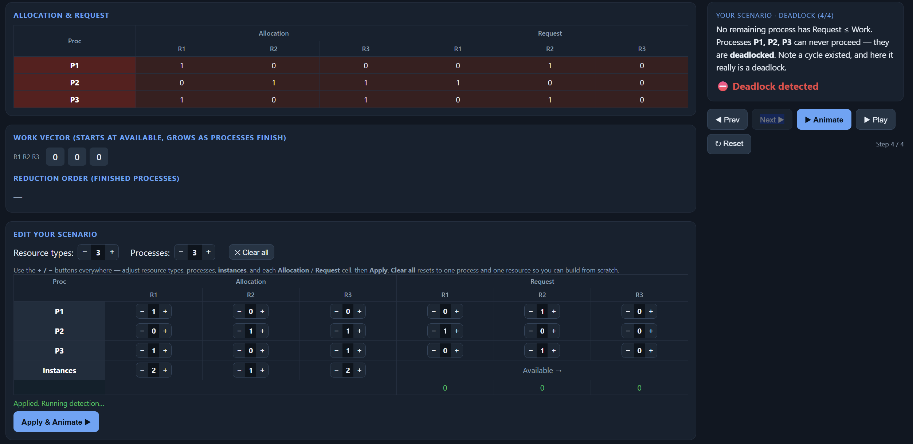

**Part B — my own scenario**
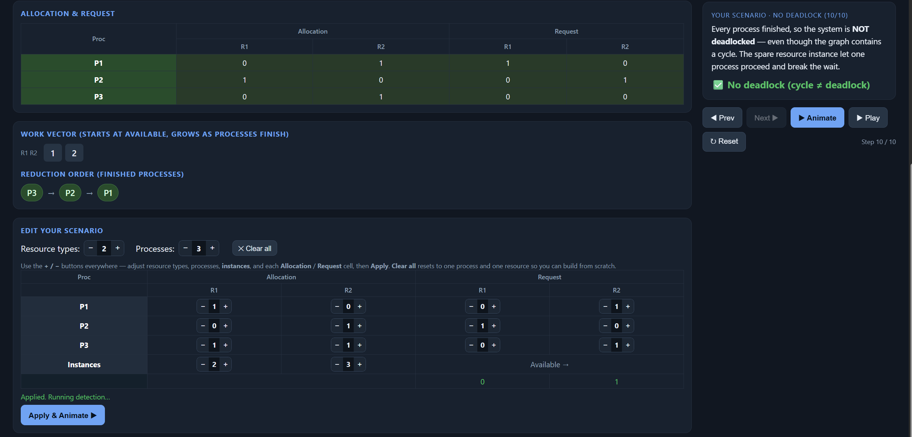
My change that caused deadlock + why (reduction terms):
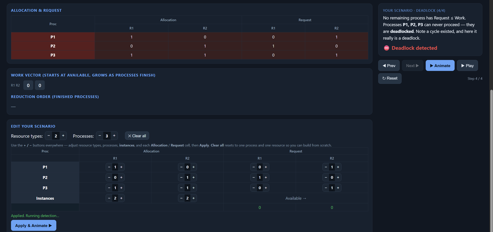

---

## Task 3 — Banker's Algorithm (my personalized scenario)

- Max[P0][A] = 7 + (a mod 3) = [...]   Max[P2][C] = 2 + (b mod 4) = [...]
- **Need matrix:** [...]
- **Available:** Total − ΣAlloc = [...]

**Safety trace (by hand):**

| Step | Process | Why Need ≤ Work | Work after release |
|------|---------|-----------------|--------------------|
| 1 | | | |
| 2 | | | |
| 3 | | | |

Conclusion: [SAFE — safe sequence = … / UNSAFE — because …]
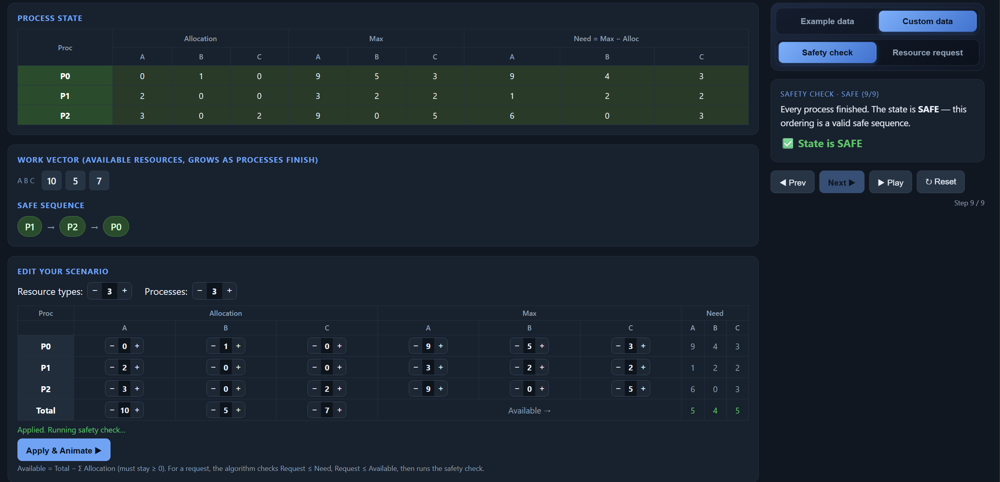
Matched the tool? [...]

**Request I predicted GRANTED:** [process + vector], checks: [...]
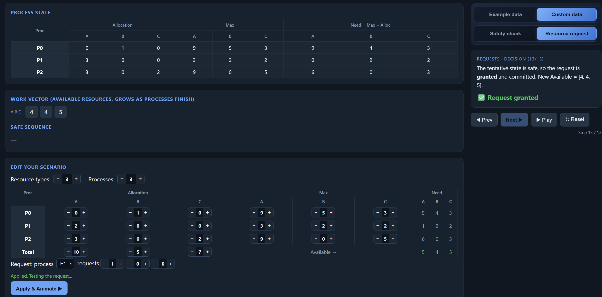

**Request I predicted DENIED:** [process + vector], which check failed / why unsafe: [...]
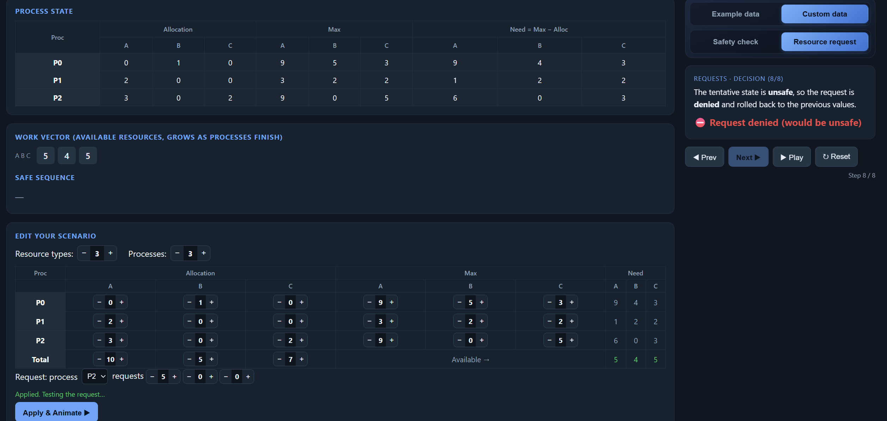

---

## Task 4 — Semaphores and Deadlock

**Case 1 (s1=s2=s3=1) — my answer:** [YES / NO] — interleaving + wait-for cycle, or why no cycle can form:
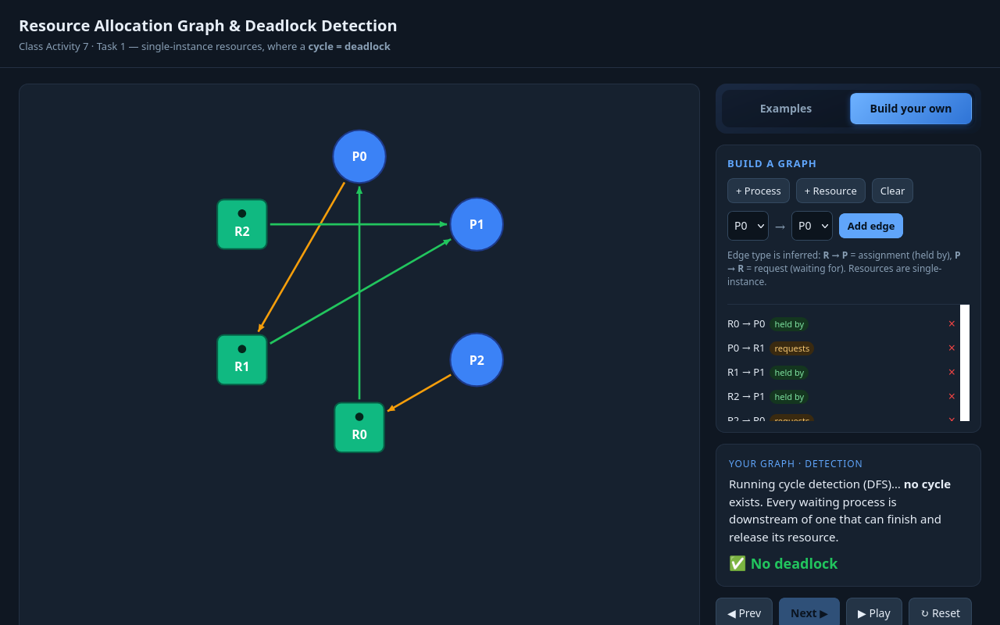
Tool confirmed? [...]

**Case 2 (s1=s2=s3=1) — my answer:** [YES / NO] — [...]
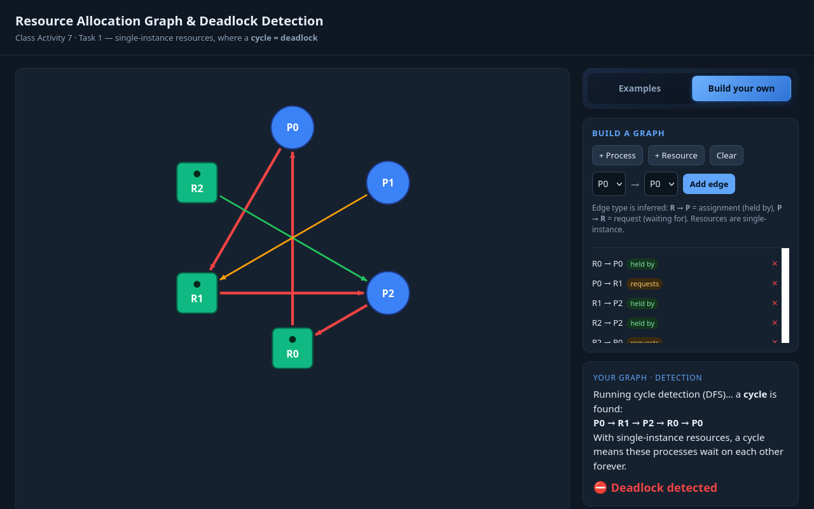
Tool confirmed? [...]

**Case 3 (s1=2) — my answer:** [YES / NO] — what the extra instance of s1 does:
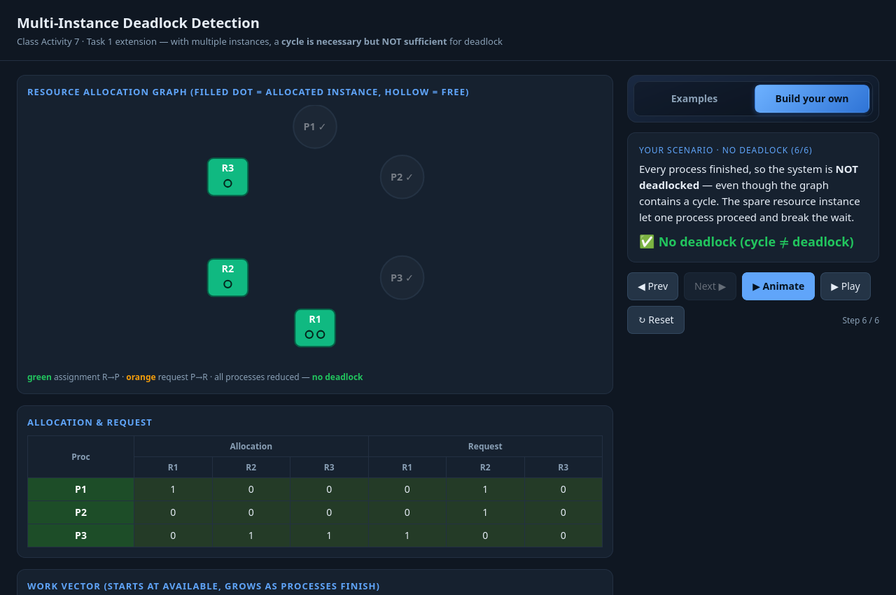
Tool confirmed? [...]

---

## Task 5 — Applied Concepts
1. [...]  2. [...]  3. [...]  4. [...]  5. [...]

---

## Reflection

_What did this activity teach you about why a cycle does not always mean deadlock, and about the trade-off between deadlock avoidance (Banker's) and detection + recovery in real systems such as databases or operating systems?_