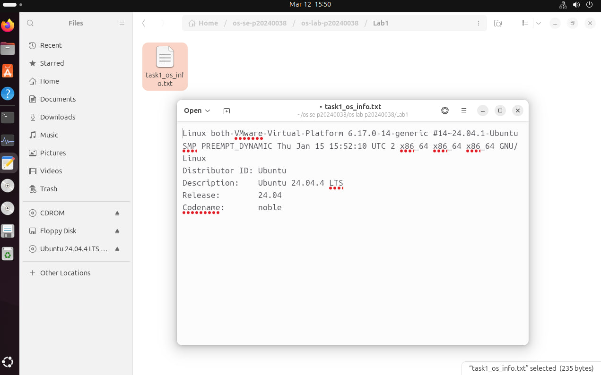
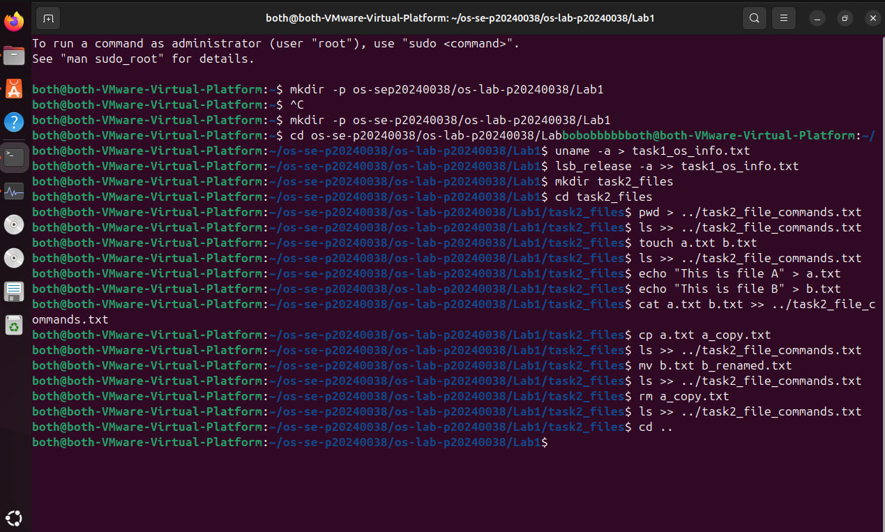
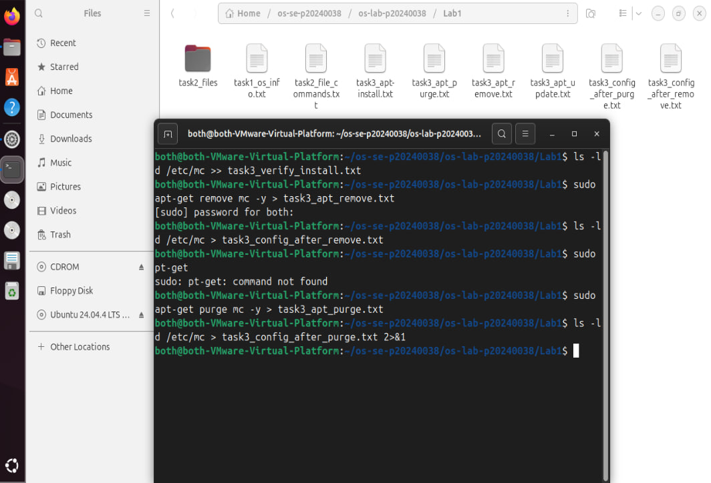
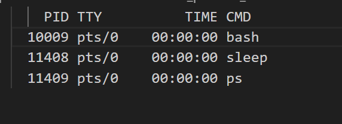
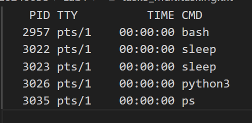
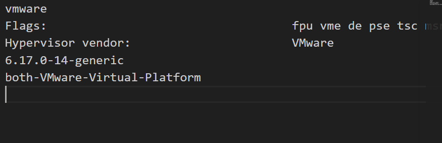

# OS Lab 1 Submission

- **Student Name:** [Rith Chankolboth]
- **Student ID:** [p20240038]

---

## Task 1: Operating System Identification

Briefly describe what you observed about your OS and Kernel here.

It tells me the ubuntu version and release date, it also tells me of the user and device.

<!-- Insert your screenshot for Task 1 below: -->
<!-- SCREENSHOT REQUIREMENT: Show the terminal after running uname -a and lsb_release -a, or the contents of your task1_os_info.txt file. -->

---

## Task 2: Essential Linux File and Directory Commands

Briefly describe your experience creating, moving, and deleting files.

creating files using the command touch or >
to append use >> 
to move files use mv
delete files use rm
<!-- Insert your screenshot for Task 2 below: -->
<!-- SCREENSHOT REQUIREMENT: Show the terminal running the file manipulation commands (mkdir, touch, cp, mv, rm) or the final cat of your task2_file_commands.txt file. -->

   

---

## Task 3: Package Management Using APT

Explain the difference you observed between `remove` and `purge`.
rm is just deleting the file or directory but all configuration is kept in etc
but purge will delete everything
<!-- Insert your screenshot for Task 3 below: -->
<!-- SCREENSHOT REQUIREMENT: Show the output of ls -ld /etc/mc after running apt-get remove (folder still exists) versus after running apt-get purge (folder is gone). -->

---

## Task 4: Programs vs Processes (Single Process)

Briefly describe how you ran a background process and found it in the process list.

so we run a command like sleep and once you run the command for process list (ps) you will see it in there. in this case its sleep.
<!-- Insert your screenshot for Task 4 below: -->
<!-- SCREENSHOT REQUIREMENT: Show the terminal where you ran sleep 120 & and the subsequent ps output showing the sleep process running. -->

---

## Task 5: Installing Real Applications & Observing Multitasking

Briefly describe the multitasking environment and the background web server.

Im not quite sure, i can see the process runs but it doesnt seem to use any cpu proccessing time, but in this vterminal i can see multiple process running at the same time 
<!-- Insert your screenshot for Task 5 below: -->
<!-- SCREENSHOT REQUIREMENT: Show the terminal ps output capturing the multiple background tasks (sleep and python3 server) running at the same time. -->

---

## Task 6: Virtualization and Hypervisor Detection

State whether your system is running on a virtual machine or physical hardware based on the command outputs.

Im running on a virtual device. as stated "Virtual-Platform" and the vmware vendor.

<!-- Insert your screenshot for Task 6 below: -->
<!-- SCREENSHOT REQUIREMENT: Show the terminal output of the systemd-detect-virt and lscpu commands. -->
