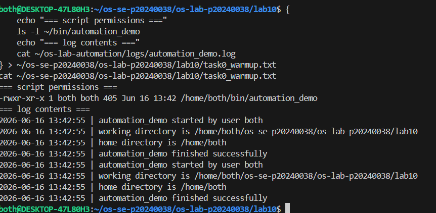
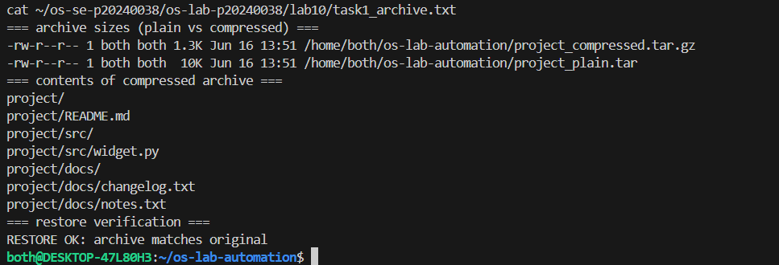
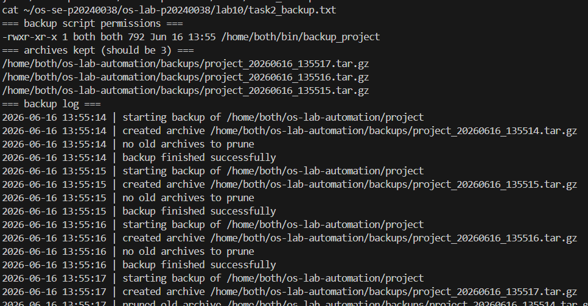
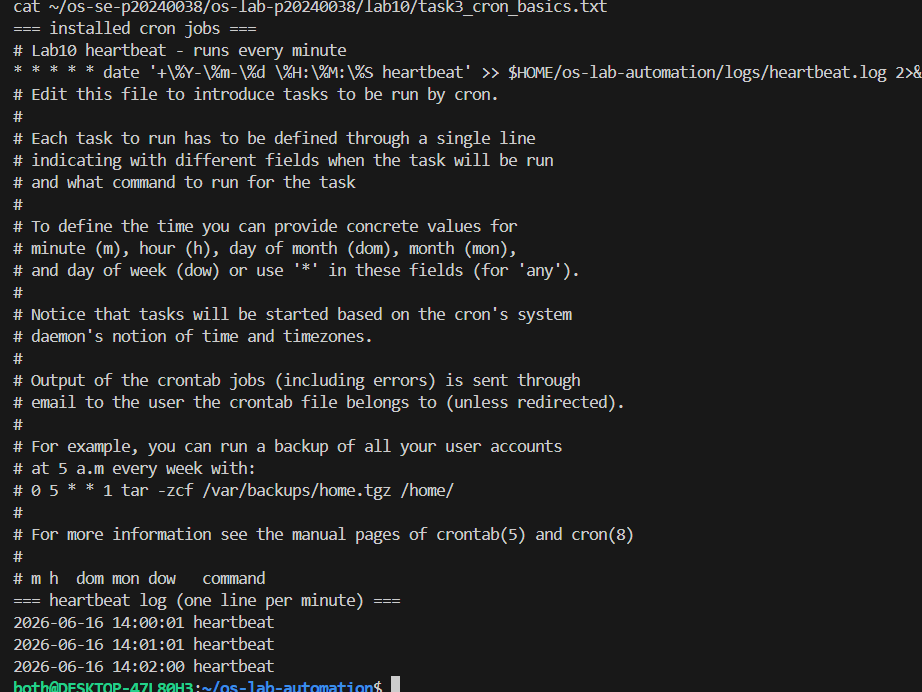

# OS Lab 10 - Backups, Archiving, Scheduling & cron Automation

> Rename this file to `README.md` inside your `lab10/` submission folder, then fill in every section.
> Replace each `` line so your screenshots actually display.
> Delete these quote-block instructions before submitting.

| | |
|---|---|
| **Student Name** | <YourName> |
| **Student ID** | p20240038 |
| **Linux Username** | both |
| **Date** | <YYYY-MM-DD> |

---

## Level 0 - Automation Warm-Up

What I did (1-2 sentences):

`<your notes>`

---

## Level 1 - Archiving & Compression

Size of `.tar` vs `.tar.gz` and why:

`<your notes>`

---

## Level 2 - File & Folder Backup Script

How my retention keeps only the 3 newest archives:

`<your notes>`

---

## Level 3 - Cron Fundamentals

My heartbeat cron line and what each field means:

`<your notes>`

---

## Level 4 - Timed Graded Cron Tasks

The two graded schedules I installed:

| Job | Schedule | Fires at |
|-----|----------|----------|
| Session job | `30 14 16 6 *` | 2:30 PM 2026-06-16 |
| Deadline job | `30 14 22 6 *` | 2:30 PM 2026-06-22 |

Session job fired during the lab (`SESSION_JOB_OK` line in `session_job.out`):

Deadline job fired before the deadline (`DEADLINE_JOB_OK` line in `deadline_job.out`):

---

## Level 5 - Scheduling the Backup

Why the job needed the absolute path and output redirect:

`<your notes>`

---

## Level 6 - Maintenance Automation

What my maintenance job rotates and reports:

`<your notes>`

---

## Level 7 - Design Your Own Scheduled Job

**What my script does:** `<describe>`

**Schedule I chose (and why):** `<your cron line + reason>`

**What each of the five cron fields means in my line:** `<your explanation>`

---

## Level 8 - Teardown and Reset

How I removed the practice jobs while keeping the graded deadline job:

`<your notes>`

---

## Lab Questions

1. **Archiving (`tar`) vs compression (`gzip`) - which shrinks bytes?**
   `<answer>`

2. **How much smaller was your `.tar.gz` than your `.tar`, and why?**
   `<answer>`

3. **Why did your cron jobs need an absolute path instead of `~/bin/...`?**
   `<answer>`

4. **Why must `%` be escaped as `\%` in a crontab, and what does `>> logfile 2>&1` do?**
   `<answer>`

5. **How does your `backup_project` retention decide what to delete, and why keep only N backups?**
   `<answer>`

6. **Write the cron line that runs `/home/me/bin/deadline_job` once at 2:30 PM on 22 June. Which fields are filled in, which stay `*`?**
   `<answer>`

7. **In Level 8 teardown, why a filtered `crontab -` pipeline instead of `crontab -r`? What would `crontab -r` have broken?**
   `<answer>`

8. **Why is a scheduled health check with a threshold alert useful in real software engineering / operations?**
   `<answer>`

9. **Describe the job you wrote in Level 7: what it does, the schedule, and the meaning of each of its five cron fields.**
   `<answer>`
