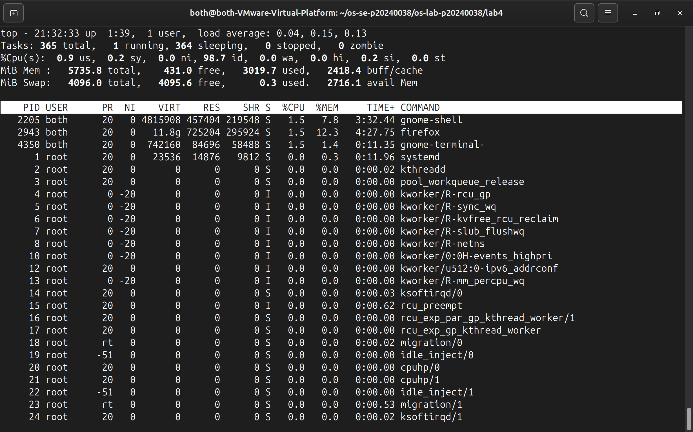
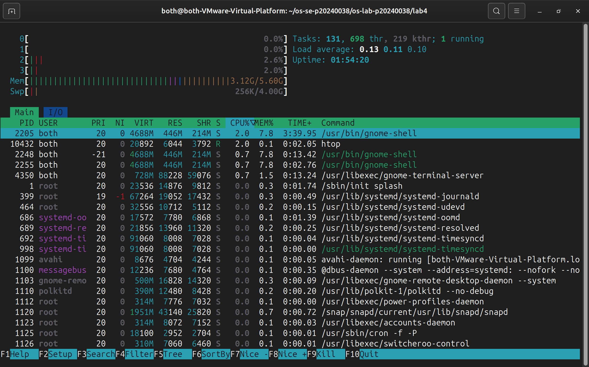
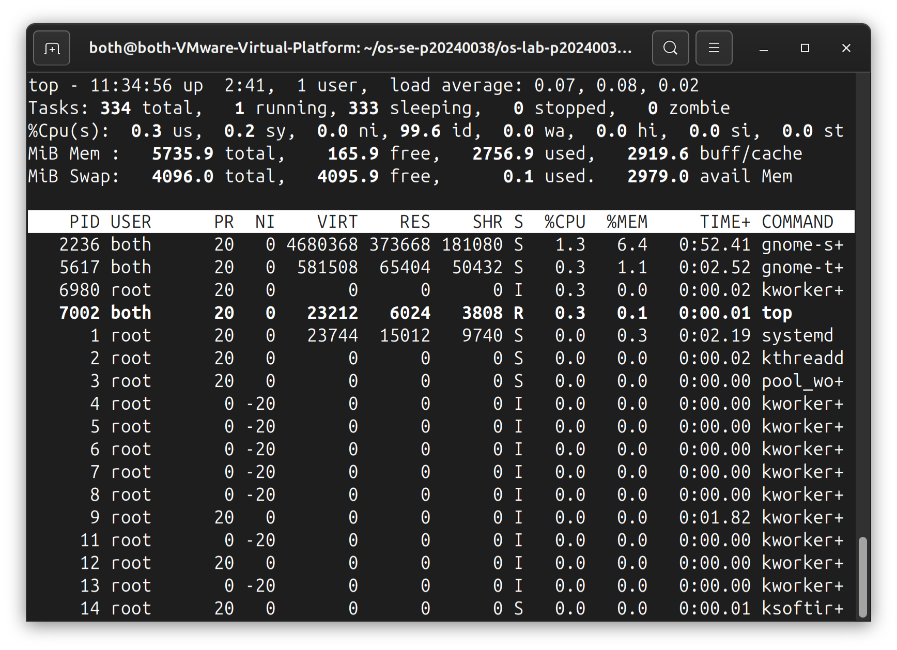

# OS Lab 4 Submission — I/O Redirection, Pipelines & Process Management

- **Student Name:** [Rith Chankolboth]
- **Student ID:** [p20240038]

---

## Task Output Files

During the lab, each task redirected its output into `.txt` files. These files are your primary proof of work for the **guided portions** of each task. Make sure all of the following files are present in your `lab4/` folder:

- [ ] `task1_redirection.txt`
- [ ] `task2_pipelines.txt`
- [ ] `task3_analysis.txt`
- [ ] `task4_processes.txt`
- [ ] `task5_orphan_zombie.txt`
- [ ] `orphan.c`
- [ ] `zombie.c`
- [ ] `access.log`

---

## Screenshots

The screenshots below document the **interactive tools**, **process observations**, **challenge sections**, and **command history**.

---

### Screenshot 1 — Task 4: `top` Output

Show `top` running with the process list and column headers visible (PID, USER, %CPU, %MEM, COMMAND).

<!-- Insert your screenshot below: -->

---

### Screenshot 2 — Task 4: `htop` Tree View

Show `htop` in tree view (F5) displaying the process hierarchy with colored CPU/memory bars.

<!-- Insert your screenshot below: -->

---

### Screenshot 3 — Task 5: Orphan Process

Show the `ps` output proving the child process's PPID changed to 1 (or systemd PID) after the parent exited.

<!-- Insert your screenshot below: -->

---

### Screenshot 4 — Task 5: Zombie Process

Show the `ps` output with the zombie process visible — state `Z` or labeled `<defunct>`.

<!-- Insert your screenshot below: -->

---

### Screenshot 5 — Task 4 Challenge: Highest Memory Process

Show `top` sorted by memory usage with the top process identified.

<!-- Insert your screenshot below: -->

---

### Screenshot 6 — Task 5 Challenge: Process Tree with 3 Children

Show `ps --forest` output with the parent and 3 child processes visible.

<!-- Insert your screenshot below: -->

---

### Screenshot 7 — Command History

After finishing all tasks, run `history | tail -n 100` and take a screenshot.

<!-- Insert your screenshot below: -->

---

## Answers to Task 5 Questions

1. **How are orphans cleaned up?**
   > Orphan processes (whose parent exits before they do) are adopted by the system's init process (PID 1, e.g. `systemd`). The init process periodically reaps them by calling `wait()` when they terminate, cleaning up their exit statuses and removing them from the process table.

2. **How are zombies cleaned up?**
   > Zombie processes (terminated processes whose exit status has not been read by their parent) are cleaned up when the parent process calls `wait()` or `waitpid()`. If the parent exits without calling wait, the zombie child is adopted by init (PID 1), which reaps it.

3. **Can you kill a zombie with `kill -9`? Why or why not?**
   > No, you cannot kill a zombie process with `kill -9` because the process is already dead (it has terminated execution and released its memory and resources). It only exists as an entry in the kernel's process table so the parent can read its exit status.

---

## Reflection

> The most useful technique I learned in this lab was building multi-command pipelines and redirecting I/O streams. In a real server environment, I would use redirection to log service outputs to disk and use pipelines (e.g. combining `cat`, `grep`, `awk`, and `sort`) to parse server access logs, identify traffic trends, find errors, and automate diagnostics reports. Observing orphan and zombie behaviors directly with `ps` also solidified my understanding of process lifecycles.
