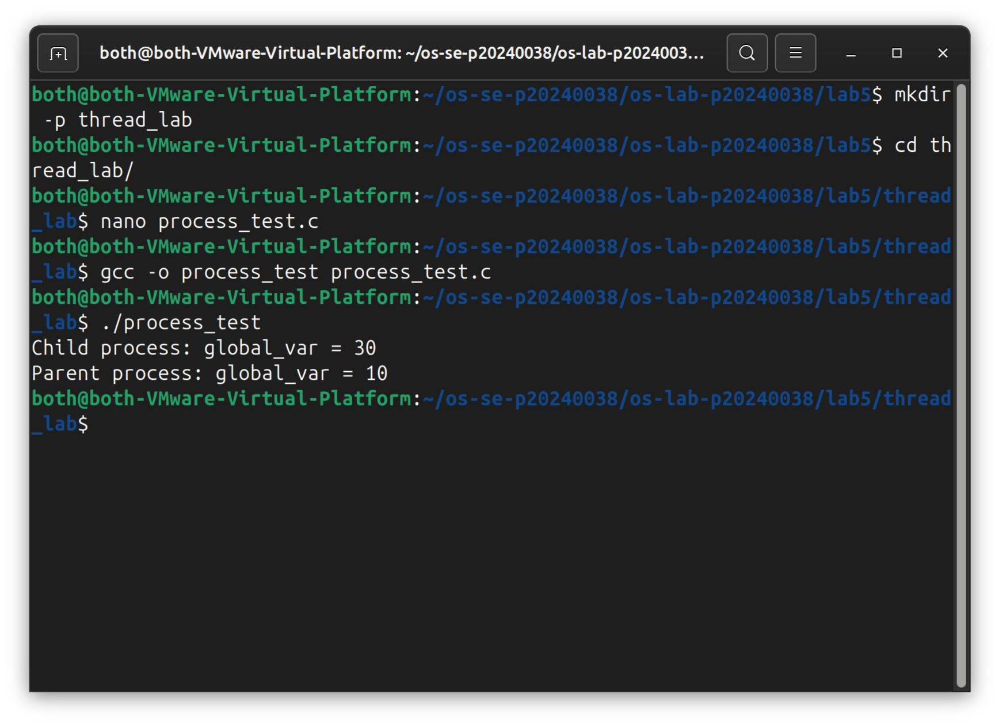
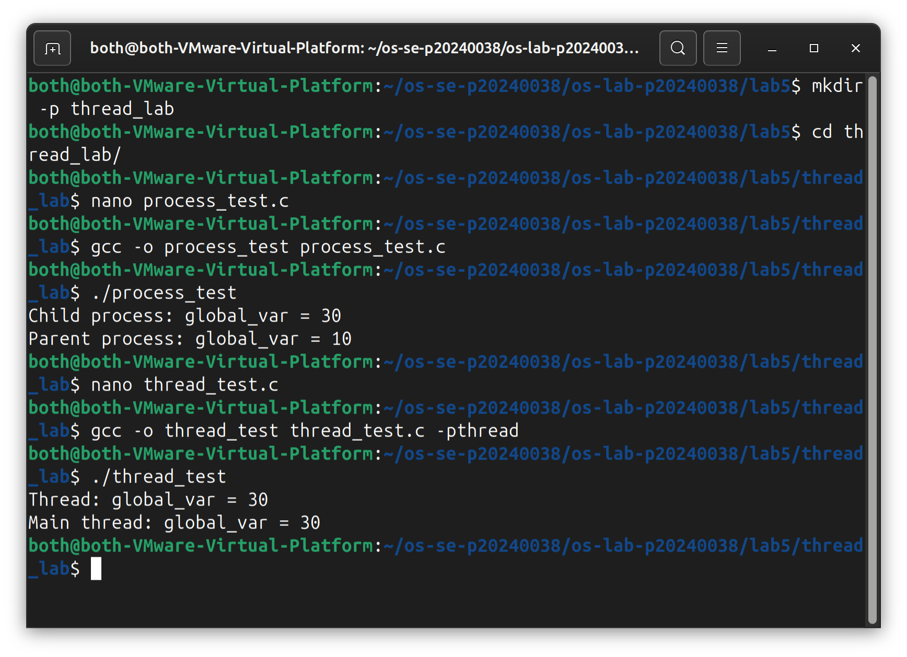
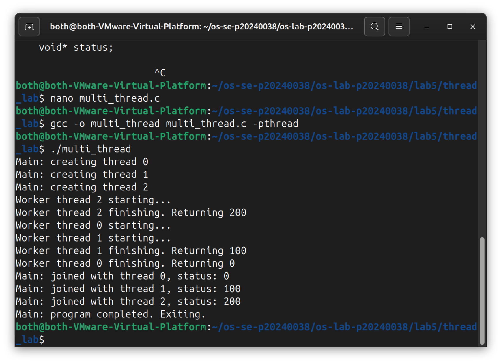
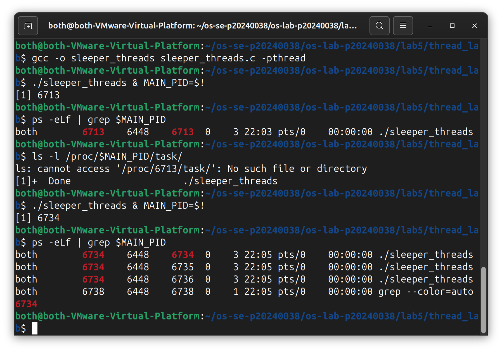
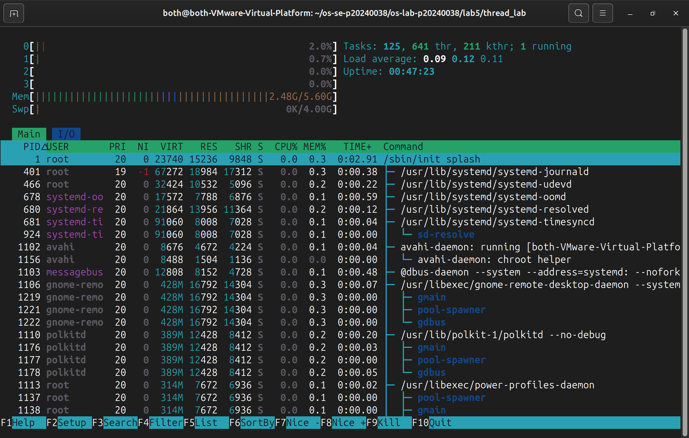
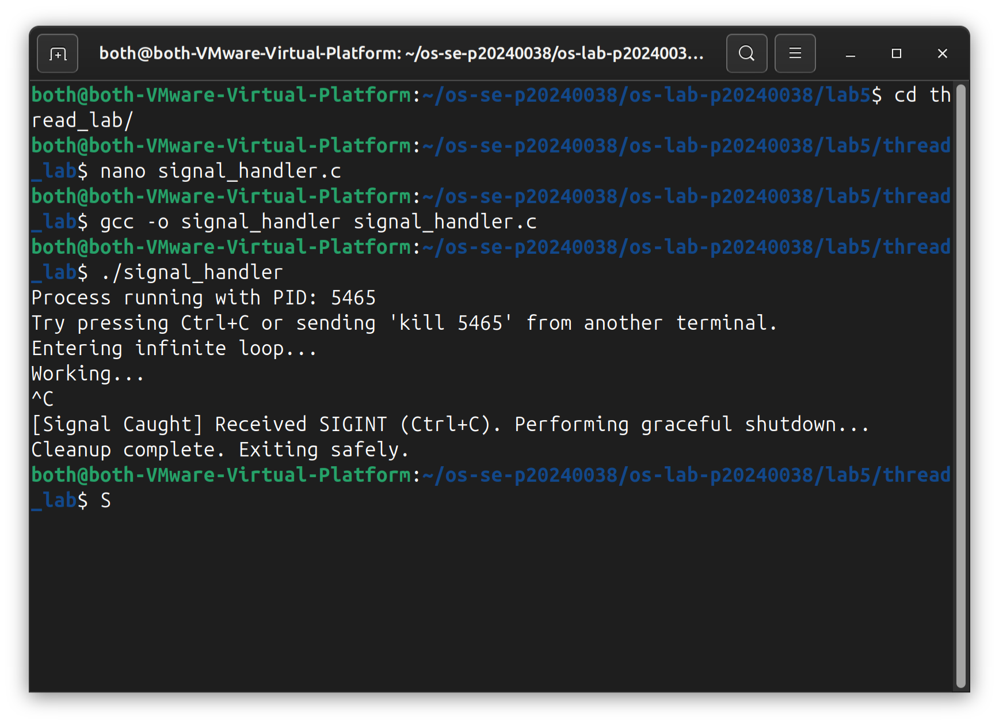
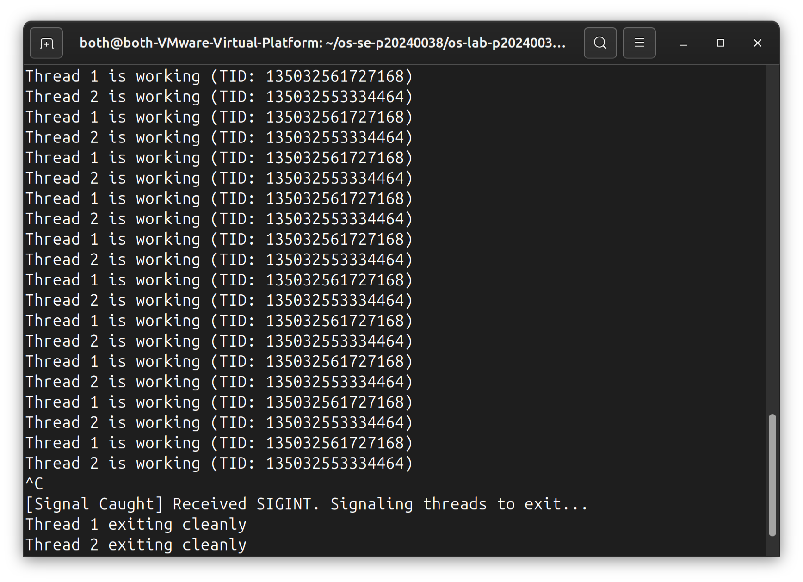

# OS Lab 5 Submission — Threads, Kernel Workers & Process Signals

- **Student Name:** [Rith Chankolboth]
- **Student ID:** [p20240038]

---

## Task Output Source Files

Make sure all of the following files are present in your `lab5/thread_lab/` folder:

- [ ] `process_test.c`
- [ ] `thread_test.c`
- [ ] `multi_thread.c`
- [ ] `sleeper_threads.c`
- [ ] `signal_handler.c`
- [ ] `challenge.c`

---

## Screenshots

Insert your screenshots below.

### Screenshot 1 — Task 1: Process vs Thread (Process Test)
Show the output of `process_test.c`.
<!-- Insert your screenshot below: -->

---

### Screenshot 2 — Task 1: Process vs Thread (Thread Test)
Show the output of `thread_test.c`.
<!-- Insert your screenshot below: -->

---

### Screenshot 3 — Task 2: Thread Interaction
Show the output of `multi_thread.c`.
<!-- Insert your screenshot below: -->

---

### Screenshot 4 — Task 3: Visualizing 1:1 Thread Mapping
Show the `ps -eLf` output or `/proc/[pid]/task/` directory visualizing the LWP mapping for user threads.
<!-- Insert your screenshot below: -->

---

### Screenshot 5 — Task 3: `htop` Kernel Threads
Show `htop` visualizing kernel threads (usually bracketed names like `[kworker]`).
<!-- Insert your screenshot below: -->

---

### Screenshot 6 — Task 4: Catching `SIGINT`
Show the output of your `signal_handler` program gracefully catching `Ctrl+C`.
<!-- Insert your screenshot below: -->

---

### Screenshot 7 — Challenge: Graceful Multithreaded Shutdown
Show the output of your `challenge.c` program joining its threads and exiting gracefully after receiving `Ctrl+C`.
<!-- Insert your screenshot below: -->

---

## Answers to Lab Questions

1. **Why do threads share memory while processes do not (by default)?**
   > Threads are lightweight execution units within the same process that share the same address space (heap, static data, code segment). Processes, by contrast, are isolated with their own independent address spaces managed by the kernel's memory management unit (MMU). Threads share memory because they are created by `pthread_create()` within the same process, inheriting the parent's virtual memory mapping. Processes are created with `fork()` which duplicates the entire memory space (copy-on-write), creating complete isolation. This design allows threads to communicate efficiently through shared variables (though requiring synchronization), while processes maintain security and stability isolation at the cost of higher overhead.

2. **Based on the 1:1 mapping, what is the role of an LWP (Lightweight Process) in Linux?**
   > An LWP (Lightweight Process) is the kernel's representation of a user-space thread. In the 1:1 threading model used by Linux, each user thread is mapped to exactly one kernel-schedulable entity (LWP). The LWP has its own kernel stack, thread-local storage (TLS), and can be independently scheduled by the kernel across CPU cores. LWPs enable true parallelism on multi-core systems because the kernel scheduler can run different LWPs from the same process simultaneously. You can identify LWPs using `ps -eLf` (which shows the LWP column) or examining `/proc/[pid]/task/` directory. The 1:1 model contrasts with M:N models where multiple user threads map to fewer kernel threads, providing better performance but more complex scheduling.

3. **Why is it restricted to send signals to kernel threads (e.g., `kthreadd` or `kworker`)?**
   > Kernel threads are internal kernel execution contexts that run only in kernel mode and manage critical kernel operations (I/O completion, memory management, workqueue tasks). Signals are a user-space synchronization and control mechanism designed for inter-process communication and user application control. Kernel threads cannot safely handle user signals because: (1) they don't have user-space signal handlers or a user context to execute them; (2) sending signals to kernel threads could disrupt critical kernel operations and compromise system stability; (3) kernel threads are not meant to be controlled by user applications—they manage resources on behalf of the kernel. The kernel enforces this restriction by preventing signal delivery to kernel threads, ensuring system integrity and preventing user processes from accidentally (or maliciously) disrupting kernel operations.

4. **Why can't `SIGKILL` (kill -9) be caught by a signal handler?**
   > `SIGKILL` is an uncatchable, non-maskable signal designed as a guaranteed termination mechanism. Unlike other signals (like `SIGTERM`, `SIGINT`, `SIGUSR1`), `SIGKILL` cannot be caught by signal handlers, blocked, or ignored. This design is intentional: it ensures the kernel can always forcefully terminate a misbehaving process that might otherwise ignore or handle termination signals indefinitely. If `SIGKILL` were catchable, a compromised or malicious program could install a handler to trap it and continue running, defeating the purpose. This makes `SIGKILL` the "nuclear option"—only the kernel decides when to actually terminate a process upon receiving it, bypassing any user-level code entirely. Other non-maskable signals include `SIGSTOP` (pause) and `SIGCONT` (resume), which have similar mandatory control mechanisms.

---

## Reflection

> The most challenging part of this lab was coordinating signals with concurrent threads. Since signals interrupt the normal thread execution flow, writing thread-safe signal handlers and managing how different threads handle or ignore signals (like catching SIGINT) requires careful design. 
> These concurrency and signal handling concepts are absolutely critical for large-scale applications like web servers or database systems, where a parent thread must listen for network connections, delegate work to pool threads, and gracefully handle termination signals (like shutdown or reload config signals) without corrupting transactions or active user connections.
