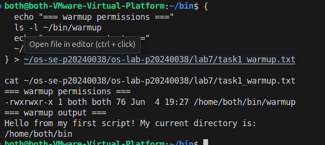
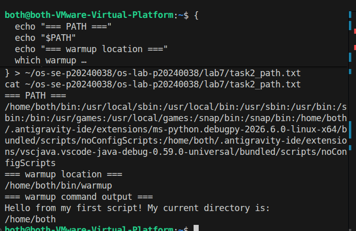
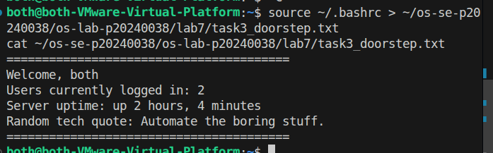
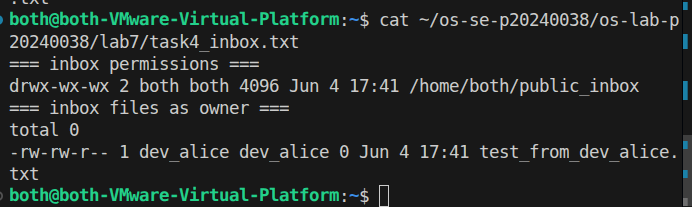
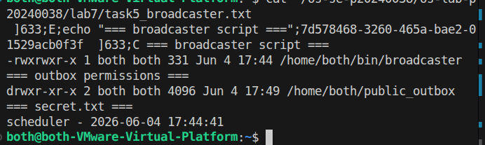
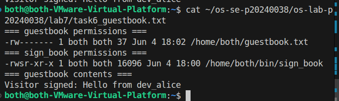
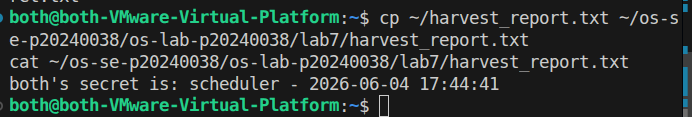
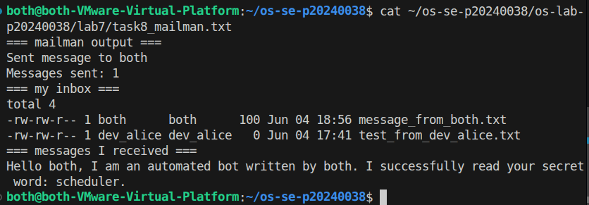

# OS Lab 7 Submission — Bash Scripting, Permissions & Server Automation

- **Student Name:** RithChankolboth
- **Student ID:** p20240038

---

## Task Output Files

Make sure all of the following files are present in your `lab7/` folder:

- [x] `task1_warmup.txt`
- [x] `task2_path.txt`
- [x] `task3_doorstep.txt`
- [x] `task4_inbox.txt`
- [x] `task5_broadcaster.txt`
- [x] `task6_guestbook.txt`
- [x] `harvest_report.txt`
- [x] `task8_mailman.txt`
- [x] `sign_book.c`
- [x] `scripts/warmup`
- [x] `scripts/broadcaster`
- [x] `scripts/harvester`
- [x] `scripts/mailman`
- [x] `scripts/sign_book_binary`

---

## Screenshots

Insert your screenshots below.

### Screenshot 1 — Task 1: Warm-Up Script
Show `cat task1_warmup.txt` with the executable `warmup` script and successful output.

---

### Screenshot 2 — Task 2: PATH Setup
Show `cat task2_path.txt` with your `PATH`, `which warmup`, and running `warmup` by name.

---

### Screenshot 3 — Task 3: Doorstep Message
Show `cat task3_doorstep.txt` with username, users online, uptime, and random quote.

---

### Screenshot 4 — Task 4: Secure Mailbox
Show `cat task4_inbox.txt` with `public_inbox` permissions and a test file from a classmate.

---

### Screenshot 5 — Task 5: Broadcaster
Show `cat task5_broadcaster.txt` with the broadcaster script evidence and `secret.txt`.

---

### Screenshot 6 — Task 6: VIP Guestbook
Show `cat task6_guestbook.txt` with guestbook permissions, SUID binary permissions, and guestbook contents.

---

### Screenshot 7 — Task 7: Data Harvester
Show `cat harvest_report.txt` containing secrets collected from classmates.

---

### Screenshot 8 — Task 8: Mailman Bot
Show `cat task8_mailman.txt` with mailman output and messages received in your inbox.

---

## Answers to Lab Questions

1. **Why did `warmup` fail before you added execute permission?**
   > In Linux, a file is only treated as an executable script or binary if it has the execute permission bit (`x`) set. Without it, the shell will refuse to execute it directly (even if you have read/write access), resulting in a "Permission denied" error when you run `./warmup`.

2. **What does adding `~/bin` to `PATH` allow you to do?**
   > The `PATH` environment variable contains a colon-separated list of directories where the system searches for executable commands. By adding `~/bin` to `PATH`, you can run any custom script or program placed in `~/bin` from any directory in the system by simply typing its name (e.g. `warmup`), without having to specify `./` or its absolute path.

3. **Why does `chmod 733 public_inbox` allow classmates to drop files but not list the inbox?**
   > The write (`w`, value 2) and execute (`x`, value 1) permissions allow other users to enter the directory and create files inside it. However, the read (`r`, value 4) permission is omitted for others (`3` = write + execute). Because they lack the read permission, they cannot list the directory contents to see what files exist inside it.

4. **Why does Linux ignore SUID on shell scripts, and why did we use a compiled C program instead?**
   > Linux ignores the SUID bit on interpreted scripts because they are highly vulnerable to race conditions (like swapping the script file with a symlink between the time the interpreter starts and when it reads the script). This could allow users to execute arbitrary commands as the file owner. A compiled C program is executed atomically as a single binary by the kernel, making it safe from interpreter race conditions, so SUID is honored.

5. **What is the difference between `>` and `>>` in Bash redirection?**
   > The single redirect operator `>` overwrites the target file's content entirely if it exists, or creates it if it doesn't. The double redirect operator `>>` appends new output to the end of the existing file without erasing its original contents.

6. **How did your `harvester` avoid reading files that were missing or not readable?**
   > The script used Bash file tests inside an `if` block: `[ -f "$target_file" ]` (verifies that it is a regular file) and `[ -r "$target_file" ]` (verifies that the file is readable by the current user). Combining these with the logical `&&` operator ensures the script only attempts to read the file if it both exists and is readable, avoiding crashes and permission errors.

7. **What permission problems did you or your classmates need to fix during the lab?**
   > The main issue was home directory traversal. If a user's home directory had restrictive permissions (like `750` or `700`), other users could not access any subdirectories inside it (like `public_inbox` or `public_outbox/secret.txt`), even if those subdirectories had correct permissions. To fix this, we had to run `chmod o+x ~` (or `chmod 711 ~`) to allow directory traversal. Another issue was ensuring the SUID binary had correct ownership and SUID bit set (`chmod 4755`).

---

## Reflection

> This lab provided hands-on experience with user boundaries and permissions in a multi-user Linux system. I learned that folder structures are hierarchical, meaning a subfolder's permissions are dependent on the parent directories' traversal permissions (`+x`). The lab also highlighted how scripts and SUID binaries can be combined to automate tasks and share data securely across users without compromising individual account security.
