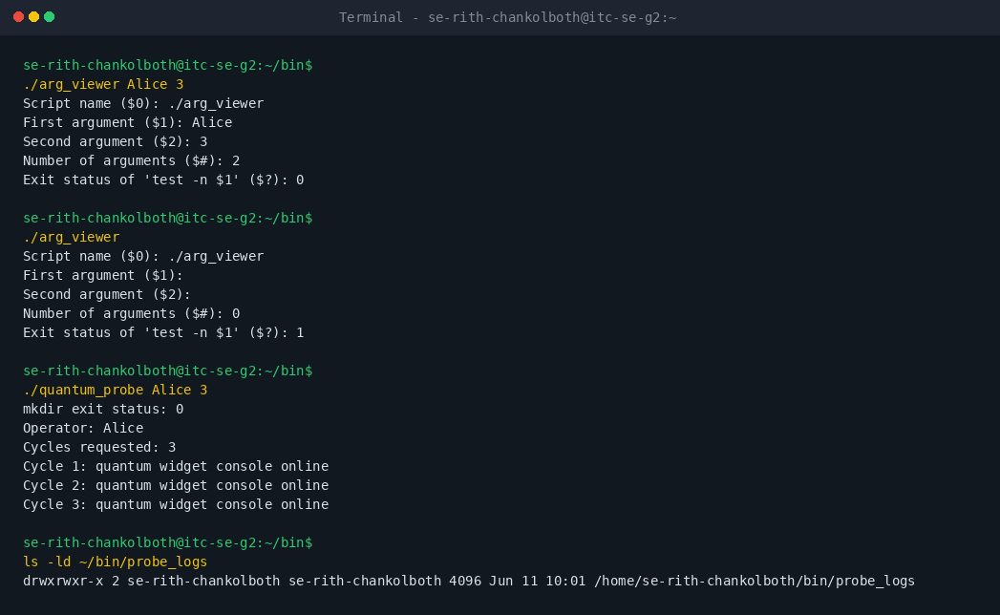
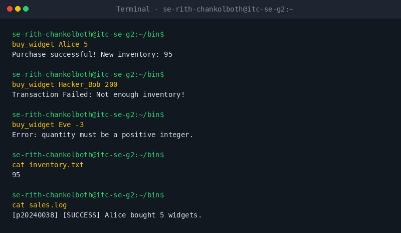
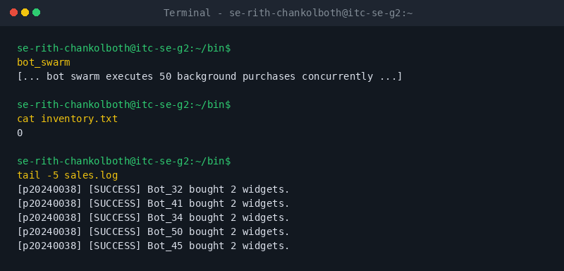
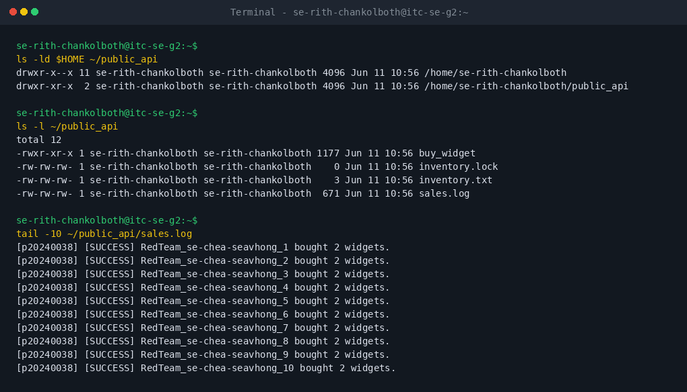
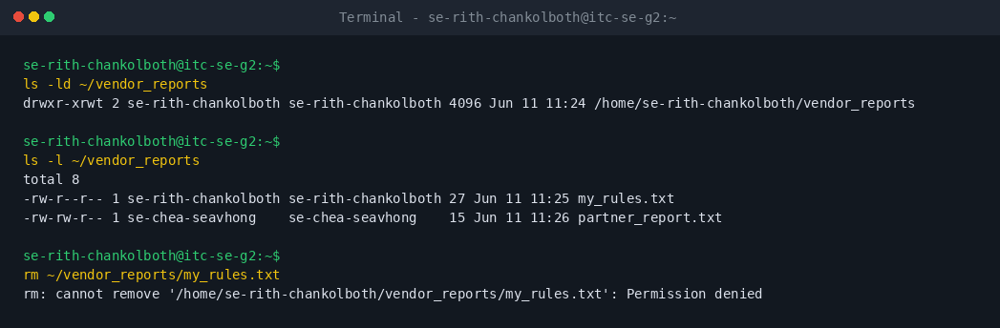
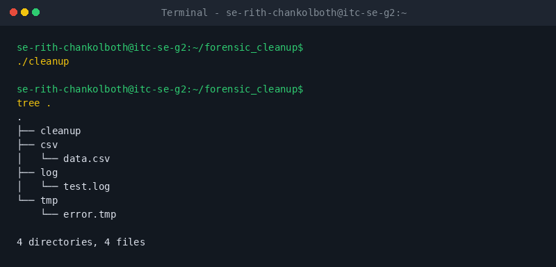

# OS Lab 8 Submission - The Quantum Widget Exploit

- **Student Name:** [Your Name Here]
- **Student ID:** [Your Student ID Here]
- **Partner Username:** [Classmate username for Levels 5-6]

---

## Task Output Files

Make sure all of the following files are present in your `lab8/` folder:

- [ ] `observations.txt`
- [ ] `task0_warmup.txt`
- [ ] `task1_validation.txt`
- [ ] `task2_audit.txt`
- [ ] `task4_mutex.txt`
- [ ] `task5_red_blue.txt`
- [ ] `task6_dropzone.txt`
- [ ] `task7_cleanup.txt`
- [ ] `scripts/arg_viewer`
- [ ] `scripts/quantum_probe`
- [ ] `scripts/buy_widget`
- [ ] `scripts/bot_swarm`
- [ ] `scripts/create_dropzone`
- [ ] `scripts/cleanup`

---

## Screenshots

Insert your screenshots below.

### Screenshot 1 - Level 0: Bash Warm-Up Scripts
Show `arg_viewer` explaining `$0`, `$1`, `$2`, `$#`, and `$?`, then show `quantum_probe` using a condition and a loop.

---

### Screenshot 2 - Level 2: Audit Trails
Show input validation, a successful sale, failed transactions, final inventory, and `sales.log`.

---

### Screenshot 3 - Level 4: Mutex Patch
Show `inventory.txt` exactly `0` after the patched `bot_swarm`, plus the last five lines of `sales.log`.

---

### Screenshot 4 - Level 5: Red Team vs. Blue Team
Show `public_api` permissions, inventory, and sales log evidence that your classmate executed your API.

---

### Screenshot 5 - Level 6: Secure Drop Zone
Show the sticky bit in `ls -ld` output and evidence that your partner could not delete your file.

---

### Screenshot 6 - Level 7: Forensic Cleanup
Show `tree` or `ls -R` output proving `.log`, `.csv`, and `.tmp` files were sorted into folders.

---

## Race Condition Observations

Summarize your five vulnerable `bot_swarm` runs from `observations.txt`:

| Run | Final Inventory | Notes |
|:---:|----------------:|-------|
| 1 |  |  |
| 2 |  |  |
| 3 |  |  |
| 4 |  |  |
| 5 |  |  |

---

## Answers to Lab Questions

1. **In `arg_viewer`, what did `$0`, `$1`, `$2`, `$#`, and `$?` mean when you ran the script?**
   > _Your answer here_

2. **What does TOC-TOU mean, and where did it appear in the vulnerable `buy_widget` script?**
   > _Your answer here_

3. **Why did `bot_swarm` sometimes leave inventory values other than `0` before the patch?**
   > _Your answer here_

4. **What part of the script is the critical section, and why must it be protected?**
   > _Your answer here_

5. **How does `flock -x` enforce mutual exclusion between concurrent processes?**
   > _Your answer here_

6. **Which permissions did you use to let a classmate run your API without giving full access to your home directory?**
   > _Your answer here_

7. **Why does the sticky bit protect files in a shared drop zone?**
   > _Your answer here_

8. **What defensive scripting practice from this lab would you use in a real production script?**
   > _Your answer here_

---

## Reflection

> _What did this lab teach you about the relationship between Bash scripts, OS scheduling, file permissions, and secure concurrent access?_
